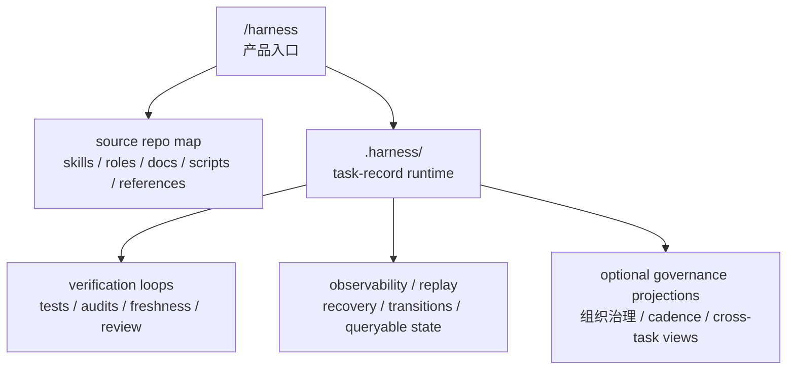

# Harness

`harness` 不是普通的技能仓库，也不该先被理解成一个“公司治理操作系统”。

它更准确的定位是：

`agent execution substrate = /harness 入口 + agent-readable repo map + minimal resumable task runtime + deterministic validation/evals + observability/replay + optional governance projections`

换句话说，它首先是给 agent 用的执行底座，其次才是治理系统。

这个 source repo 负责六件事：

1. 定义入口：`SKILL.md`
2. 定义能力包：`skills/`
3. 定义责任与路由基线：`roles/`、`docs/workflows/`
4. 定义合同：`references/`
5. 提供执行器：`scripts/`
6. 提供可验证、可审计、可恢复的读取与写回入口

它不保存任何 consumer repo 的 live runtime truth。真正运行时的任务状态，只会按需 materialize 到 consumer repo 的 `.harness/`。

## 第一性原理

一个 production-grade agent harness，首先必须解决的不是“怎么模拟组织”，而是下面这些更底层的问题：

1. agent 能不能快速读懂当前 repo
2. 长任务在跨 session / 跨 context window / 工具失败后，能不能从中断点恢复
3. agent 的动作有没有可重复验证的反馈回路
4. 状态为什么改变、改变到了哪里，能不能回放与解释
5. 只有在跨任务协调真的存在时，才引入治理投影

因此，`harness` 的默认产品心智不是“模拟一家公司”，而是“让 agent 在 repo 内可读、可做、可恢复、可验证、可追踪”。

## 结构心智

`harness` 里有四类结构对象，但它们不是同一种东西：

| Layer | Meaning | Canonical Surface |
| --- | --- | --- |
| `root` | 宪法层、共享底座、总入口 | `SKILL.md`, `docs/`, `references/`, `roles/`, `scripts/` |
| `skills` | 自包含能力 bundle | `skills/*` |
| `roles` | 责任主体与默认路由基线 | `roles/*` |
| `departments` | runtime-local 协作边界的治理投影 | `.harness/workspace/departments/*` when materialized |

一句话：

1. `skill` 不是 agent
2. `role` 不是 skill
3. `department` 不是 source repo 顶层目录
4. 组织结构是树，能力结构是图
5. runtime primitive 先于 governance projection

详细地图见：

- [governance-capability-map.md](/Users/vx/WebstormProjects/harness/docs/organization/governance-capability-map.md)

## 一句话心智模型

`harness = /harness 入口 + agent-readable repo map + 按需 materialize 的 minimal task-record runtime + deterministic validation/evals + observability/replay + optional governance projections`

这几个词的优先级不要搞反：

1. 先有 legibility
2. 再有 runtime continuity
3. 再有 verification loops
4. 再有 observability / replay
5. 最后才是 governance projection

## 四层分层



对应参考：

- [references/layering.md](/Users/vx/WebstormProjects/harness/references/layering.md)
- [references/runtime-workspace.md](/Users/vx/WebstormProjects/harness/references/runtime-workspace.md)
- [references/top-level-surface.md](/Users/vx/WebstormProjects/harness/references/top-level-surface.md)
- [task-record-runtime-tree-v2.toml](/Users/vx/WebstormProjects/harness/references/contracts/task-record-runtime-tree-v2.toml)
- [org-chart.md](/Users/vx/WebstormProjects/harness/docs/organization/org-chart.md)
- [governance-capability-map.md](/Users/vx/WebstormProjects/harness/docs/organization/governance-capability-map.md)

## Skills Are Bundles

`skills/*` 是最重要的能力面，应该坚持自包含。

如果某个 capability 专用的文档、模板、脚本、rubric 只服务一个 skill，就优先放进该 skill：

```text
skills/<bundle-slug>/
  SKILL.md
  manifest.toml
  refs/
  templates/
  scripts/
```

不要把只服务一个 skill 的 `templates / refs / scripts` 回流到 root。

root 只保留：

1. 全局 contract
2. 全局 workflow
3. 共享脚本基础设施
4. baseline role 定义
5. 总导航与审计入口

## Frontier Priority

如果按 2025-2026 社区里更稳的 harness 经验排序，优先级应是：

1. agent legibility
   - 入口短
   - 读取顺序稳定
   - 文档可按需展开
2. resumability
   - 长任务跨 context window 仍可恢复
   - 当前 focus、next command、history 可回放
3. deterministic verification
   - tests、audit、freshness gate、review loop 必须可重复执行
4. observability and replay
   - state transition 要能解释
   - query surface 要能回放当前工作面
   - recovery 写回不能形成第二套平行账本
5. optional governance projection
   - 跨任务投影、部门协作、cadence 只在需要时启用

因此 `harness` 的默认产品心智不是“模拟一家公司”，而是“让 agent 在 repo 内可读、可做、可恢复、可验证、可追踪”。

## Runtime Primitives First

`harness` 的默认 runtime，不应先从部门、角色、board 出发，而应先从几个更底层的 primitive 出发：

1. `task record`
   - 当前任务为何存在、处于什么状态、下一步做什么
2. `attachments`
   - task-local 正式材料与证据
3. `transitions`
   - 状态迁移与可审计历史
4. `locks`
   - 受控状态修改期间的并发保护
5. `query`
   - 面向 agent 的读取视图，而不是账本本体
6. `validation`
   - 对 runtime contract、文档系统、freshness 与状态机的可重复验证

`roles` 与 `departments` 可以存在，但它们默认应被理解成 routing / coordination / governance projection，而不是 runtime substrate 本体。

## Governance Capability Families

当前 skills 更适合按治理能力理解，而不是当作一条单流水线：

1. intake and framing
   - `founder-brief`, `meeting-router`, `brainstorming-session`, `vision-meeting`
2. discovery and evidence
   - `research`, `capability-scout`
3. scope and decision
   - `requirements-meeting`, `decision-pack`, `acceptance-review`
4. memory and writeback
   - `memory-checkpoint`, `daily-digest`
5. governance and compounding
   - `governance-meeting`, `process-audit`, `os-audit`, `retro`

## 最小 runtime

v2 的最小 runtime 已经收敛到 flat task-record：

```text
.harness/
  manifest.toml
  entrypoint.md
  README.md
  tasks/
    WI-xxxx/
      task.md
      attachments/
      closure/
      history/
        transitions/
  locks/
```

核心约束：

1. `task.md` 是唯一任务执行真相
2. Recovery 写在同一个 `task.md` 里
3. `archived` 用状态字段表达
4. board 不是默认 runtime contract；默认改为 shell query

## `task.md` 是什么

`.harness/tasks/WI-xxxx/task.md` 是唯一任务执行真相，也是 human + agent 的主读取入口。

注意边界：

1. 它是 task execution state 的 canonical record
2. 它不是代码真相，代码真相仍在 repo
3. 它不是测试真相，测试真相仍在 tests / audit outputs
4. 它不是需求全文真相，正式材料仍在 `attachments/` 与相关 spec
5. 它不是第二套 workflow engine；真正状态迁移仍受脚本、锁与验证面约束
6. 它的职责是把“当前任务为什么在这里、现在该做什么、下一步怎么恢复”压缩成单一入口

同时要注意：

1. `task.md` 是面向人和 agent 的 canonical surface
2. machine-readable contract 仍由 `references/contracts/*` 与验证脚本约束
3. 如果未来需要更细粒度 machine state，也应从 task record 派生，而不是再引入第二套平行 truth

它不只是轻 ticket，而是一个重实体 task record，至少承载这几组字段：

1. 身份与主状态
   - `ID`
   - `Title`
   - `Type`
   - `Status`
   - `Priority`
2. claim / 执行上下文
   - `Assignee`
   - `Worktree`
   - `Claimed at`
   - `Claim expires at`
   - `Lease version`
3. 流程路由
   - `Current stage owner`
   - `Current stage role`
   - `Next gate`
   - `Required departments`
   - `Participation records`
4. gate / 签字状态
   - `Decision status`
   - `Review status`
   - `QA status`
   - `UAT status`
   - `Acceptance status`
5. 恢复协议
   - `## Recovery`
   - `Current focus`
   - `Next command`
   - `Recovery notes`
6. 关联材料
   - `Linked attachments`
   - `attachments/`
   - `history/transitions/`

其中 `Current stage role`、`Required departments`、`Participation records` 是路由与协作元数据，不是 substrate 的第一性对象。

## 主状态机

v2 的主状态只保留：

```text
backlog -> planning -> ready -> in-progress -> review -> done -> archived
```

补充分支：

- 任意执行中可进 `paused`
- 任意阶段可进 `killed`
- `archived` 表示退出默认 active query surface，而不是物理搬目录

`review / QA / UAT / acceptance` 默认不再膨胀成主状态，而是 gate 字段。

## Attachments

task-local 正式材料默认放在 `attachments/`：

1. `Research Dispatch`
   - `.harness/tasks/<task-id>/attachments/<date>-<slug>-research-dispatch.md`
2. `Research Brief`
   - `.harness/tasks/<task-id>/attachments/<date>-<slug>-research-brief.md`
3. `Source Note`
   - `.harness/tasks/<task-id>/attachments/sources/<date>-<slug>.md`
4. `Research Memo`
   - `.harness/tasks/<task-id>/attachments/<date>-<slug>-research-memo.md`
5. Optional `Evidence Ledger`
   - `.harness/tasks/<task-id>/attachments/<date>-<slug>-evidence-ledger.md`
6. `Decision Pack`
   - `.harness/tasks/<task-id>/attachments/<date>-<slug>-decision-pack.md`
7. `Checkpoint`
   - `.harness/tasks/<task-id>/attachments/<date>-<slug>-checkpoint.md`

注意：

1. `Source Note` 是默认正式证据 artifact
2. `Research Memo` 是综合判断 artifact
3. `Research Brief` 只在 collection 复杂时推荐
4. `Evidence Ledger` 是可选台账，不该变成强制 paperwork
5. 默认坚持 task-local first，避免过早 promote 到 governance 面

只有显式 `--promote-governance` 且 runtime 已进入 advanced governance mode，才允许写到 `.harness/workspace/*`。

## 命令面

推荐高层入口：

```bash
./scripts/work_item_ctl.sh status --json --all
./scripts/work_item_ctl.sh start --json company
./scripts/work_item_ctl.sh pause --expected-from-status in-progress --expected-version <v> --interrupt-marker risk-review-required <WI-xxxx>
./scripts/work_item_ctl.sh resume --expected-version <v> <WI-xxxx>
./scripts/work_item_ctl.sh close --json --target-status review --work-item <WI-xxxx> company
./scripts/query_work_items.sh --status in-progress --assignee codex
```

注意：

1. `status` 现在是 `query` 别名，不再是“open 当前焦点”
2. task-local artifact 写回一律要求显式 `--work-item`
3. `./scripts/upsert_work_item_recovery.sh` 写入 `task.md` 的 `## Recovery`

## 运行时读取顺序

materialized runtime 下，正确读取顺序是：

1. `.harness/README.md`
2. `.harness/entrypoint.md`
3. `./scripts/query_work_items.sh` 的结果，或明确的 `.harness/tasks/<task-id>/task.md`
4. 若状态为 `in-progress` / `paused`，再读该 task 的 `## Recovery`
5. 只在需要时读取 `attachments/` 和 `history/transitions/`

## 验证、审计与可回放性

frontier harness 的关键不是“有状态”，而是“状态可验证、可解释、可恢复”。

因此验证面应被视为一等公民，而不是附属脚本：

framework source repo：

```bash
./scripts/validate_source_repo.sh
./scripts/audit_role_schema.sh
./scripts/run_governance_surface_diagnostic.sh --mode source
```

materialized runtime：

```bash
./scripts/validate_workspace.sh --mode core
./scripts/audit_state_system.sh --mode core
./scripts/audit_document_system.sh
./scripts/validate_freshness_gate.sh --staged
./scripts/run_state_validation_slice.sh
```

当前 runtime 的可回放入口主要来自：

1. `task.md` 的 `## Recovery`
2. `history/transitions/`
3. query 输出
4. audit / validation 输出

## 设计纪律

1. `task.md` 是唯一任务执行真相
2. query 是视图，不是账本
3. 目录不承载业务状态
4. verification loop 不是附属能力，而是 runtime 主链的一部分
5. observability / replay 是核心能力，不是事后补丁
6. governance 是 projection，不是默认前台叙事
7. Recovery 只回答恢复执行所需的最小问题
8. task-local first，governance by explicit promotion
9. source repo 不保存 consumer runtime 的 live state
