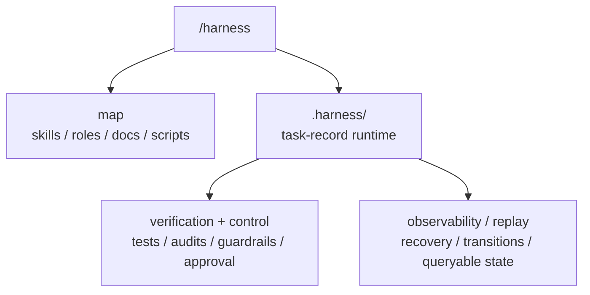

# Harness

`harness` 不是普通的技能仓库，也不该先被理解成一个“公司治理系统”。

它的 canonical 定位是：

```text
agent execution substrate =
  /harness 入口
  + agent-readable repo map
  + minimal resumable task runtime
  + deterministic validation/evals
  + observability/replay
  + control surfaces
```

换句话说，它首先是给 agent 用的执行底座，不是组织结构投影。

## Source Repo Scope

这个 source repo 负责六件事：

1. 定义入口：`SKILL.md`
2. 定义能力包：`skills/`
3. 定义责任与路由基线：`roles/`、`docs/workflows/`
4. 定义合同：`references/`
5. 提供执行器：`scripts/`
6. 提供可验证、可审计、可恢复的读取与写回边界

它不保存任何 consumer repo 的 live runtime truth。
真正运行时的任务状态，只会按需 materialize 到 consumer repo 的 `.harness/`。

## 第一性原理

一个 production-grade agent harness，默认必须先解决：

1. agent 能不能快速读懂当前 repo
2. 长任务在跨 session / 跨 context window / 工具失败后，能不能从中断点恢复
3. agent 的动作有没有可重复验证的反馈回路
4. 状态为什么改变、改变到了哪里，能不能回放与解释
5. 高风险动作有没有足够硬的控制面

因此，`harness` 的默认产品心智不是“模拟一家公司”，而是“让 agent 在 repo 内可读、可做、可恢复、可验证、可追踪”。

## 结构心智

`harness` 里默认只有三类 active source 对象：

| Layer | Meaning | Canonical Surface |
| --- | --- | --- |
| `root` | 共享底座、总入口、总规则 | `SKILL.md` + core dirs |
| `skills` | 自包含能力 bundle | `skills/*` |
| `roles` | 责任主体与默认路由基线 | `roles/*` |

其中 `root` 的 core dirs 指：

- `docs/`
- `references/`
- `roles/`
- `scripts/`

一句话：

1. `skill` 不是 agent
2. `role` 不是 skill
3. 目录树不等于组织图
4. 能力结构是图，不是公司层级
5. runtime primitive 先于任何协作叙事

## 一句话心智模型

```text
harness =
  /harness 入口
  + agent-readable repo map
  + minimal task-record runtime
  + deterministic validation/evals
  + observability/replay
  + control surfaces
```

这几个词的优先级不要搞反：

1. 先有 legibility
2. 再有 runtime continuity
3. 再有 verification loops
4. 再有 observability / replay
5. 最后才是需要时才显式启用的共享写回或本地扩展

## 三层分层



对应参考：

- [references/layering.md](/Users/vx/WebstormProjects/harness/references/layering.md)
- [references/runtime-workspace.md](/Users/vx/WebstormProjects/harness/references/runtime-workspace.md)
- [references/top-level-surface.md](/Users/vx/WebstormProjects/harness/references/top-level-surface.md)
- [task-record-runtime-tree-v2.toml](/Users/vx/WebstormProjects/harness/references/contracts/task-record-runtime-tree-v2.toml)

## Skills Are Bundles

`skills/*` 是最重要的能力面，应该坚持自包含。

如果某个 capability 专用的文档、模板、脚本、rubric 只服务一个 skill，就优先放进该 skill：

```text
skills/<bundle-slug>/
  SKILL.md
  manifest.toml
  refs/
  templates/
  scripts/
```

不要把只服务一个 skill 的 `templates / refs / scripts` 回流到 root。

root 只保留：

1. 全局 contract
2. 全局 workflow
3. 共享脚本基础设施
4. baseline role 定义
5. 总导航与审计入口

## Skills Need Progressive Disclosure

`skills/*` 不只是“自包含”，还应当满足“窄触发、晚展开”。

一个好的 skill bundle，默认应做到：

1. `SKILL.md` 先回答触发条件、目标产出、读取顺序
2. 详细说明、模板、脚本放在 `refs/`、`templates/`、`scripts/`，只在命中 skill 后按需读取
3. skill 描述负责路由，skill 内部材料负责深度，不把所有上下文常驻在 root 入口
4. skill 的目标是压缩默认上下文，而不是重新制造一个巨型总提示词
5. 若 skill 会驱动 subagent / hooks / MCP，
   还应显式声明 tool scope、memory scope 与
   verification expectation
6. skill bundle 是 capability package，
   不是 durable memory store；
   skill 运行中产出的决定、证据与恢复信息，
   若会影响任务执行，
   必须回落到 `task.md` / `attachments/` / `history/`
7. 常驻 `rules / policy / project memory` 与按需 skill 展开必须分层；前者定义默认行为基线，后者提供窄任务能力，不互相替代

## Survivor-First Compaction

agent 可以在探索阶段快速做加法，但 `harness` 的 active surface 不能因此持续膨胀。

默认原则：

1. 探索可以是 additive，active surface 必须是 subtractive
2. 每个 durable write 都必须先回答 disposition：
   - 更新现有 canonical surface
   - 写 task-local artifact
   - 显式 promote 到 shared writeback
   - 进入 cold archive
3. 若一个新文件只是重复转述旧推导，而不是新增承重信息，就不应进入 active surface
4. checkpoint / compaction memo / status snapshot
   的职责不是再造一份总结，
   而是把当前工作面压缩成更小的 survivor state
5. 历史可以为审计与回放保留，但默认必须退出 working set

这里的 `承重` 至少指以下任一职责：

1. 当前任务恢复离不开它
2. 当前控制面、路由面或验证面离不开它
3. 它比回读原始 lineage 更便宜
4. 它包含不可廉价重建的证据、决策或边界

## README Is A Compaction Boundary

`README.md` 不只是介绍页，它还是 source repo 的默认读序入口与 repo-level compaction boundary。

这意味着 README 的演化默认也必须做减法：

1. 新心智进入 README 时，应优先改写、压缩或替换旧段落，而不是叠加平行模型
2. 若一个概念已经有 canonical 表达，后续更新应优先 patch 原位置，而不是再长出一个旁支文档
3. 若必须新增 surface，就应同时回答谁被 supersede、谁进 archive、谁只保留 redirect
4. README 只保留跨 skill、跨 workflow 都承重的规则；task-specific、skill-specific、历史推导性的内容应下沉到对应文档
5. 自动化在更新 README 时，默认目标不是“多写一些解释”，而是让默认读取路径更短、更稳、更少歧义
6. 若 active surface 增长但没有同步发生 compress / merge / archive，这应被视为 repo entropy 增长，而不是自然演化

## Frontier Priority

如果按 2025-2026 社区里更稳的 harness 经验排序，优先级应是：

1. agent legibility
   - 入口短
   - 读取顺序稳定
   - 文档可按需展开
2. resumability
   - 长任务跨 context window 仍可恢复
   - 当前 focus、next command、history 可回放
   - `task truth`、`execution checkpoint`、`transport state` 必须分层
3. deterministic verification
   - tests、audit、freshness gate、review loop 必须可重复执行
4. observability and replay
   - state transition 要能解释
   - query surface 要能回放当前工作面
   - recovery 写回不能形成第二套平行账本
5. control surfaces
   - approval、policy、guardrail、permission boundary 必须清晰

## Runtime Primitives First

`harness` 的默认 runtime，不应先从组织层或协作树出发，而应先从几个更底层的 primitive 出发：

1. `task record`
   - 当前任务为何存在、处于什么状态、下一步做什么
2. `attachments`
   - task-local 正式材料与证据
3. `transitions`
   - 状态迁移与可审计历史
4. `locks`
   - 受控状态修改期间的并发保护
5. `execution checkpoints`
   - 可选的 engine-local step snapshots，
     用于 durable execution、resume、fork 与 pending writes
6. `query`
   - 面向 agent 的读取视图，而不是账本本体
7. `validation`
   - 对 runtime contract、文档系统、freshness 与状态机的可重复验证
8. `control surfaces`
   - approval、policy、guardrails、tool / permission boundary

## Capability Families

当前 skills 更适合按执行能力理解，而不是按组织会议理解：

1. intake and framing
   - `founder-brief`, `meeting-router`, `brainstorming-session`, `vision-meeting`
2. discovery and evidence
   - `research`, `capability-scout`
3. scope and decision
   - `requirements-meeting`, `decision-pack`, `acceptance-review`
4. memory and writeback
   - `memory-checkpoint`
5. audit and compounding
   - `process-audit`, `os-audit`

## 最小 Runtime

v2 的最小 runtime 已经收敛到 flat task-record：

```text
.harness/
  manifest.toml
  entrypoint.md
  README.md
  tasks/
    WI-xxxx/
      task.md
      attachments/
      closure/
      history/
        transitions/
  locks/
```

核心约束：

1. `task.md` 是唯一任务执行真相
2. Recovery 写在同一个 `task.md` 里
3. `archived` 用状态字段表达
4. 目录不承载业务状态
5. board、digest、org chart 都不是默认 runtime contract

## 三层状态边界

2025-2026 的 frontier agent runtime，
已经越来越常见地提供 durable conversation state、
background jobs、server-side compaction、stream resume、
workflow checkpoints 与 provider-owned threads。

这些能力都很有用，但它们不是同一种 state。默认应分成三层：

1. `task truth`
   - `task.md`、`attachments/`、`history/transitions/`
     组成跨 provider、跨 session 稳定的 canonical task state
2. `execution checkpoint state`
   - workflow engine 的 `thread_id`、`checkpoint_id`、
     pending writes、fork point、interrupt cursor
     等细粒度执行快照
   - 它可以 durable，但仍然只是 engine-local execution state，不是任务真相
3. `transport state`
   - provider conversation / response / thread / background job /
     compaction item / stream cursor 等 provider-owned state
   - 它可以 durable，但仍然只是 transport layer，不应直接驱动业务状态机

补充边界：

1. opaque compaction item、raw transcript、
   provider thread history、checkpoint internals
   都不应直接晋升为 canonical task state
2. 若需要恢复 engine run 或 provider run，
   可在 `task.md` 的 recovery 或 `history/` 中
   记录临时 execution handles，例如
   `thread_id`、`checkpoint_id`、`response_id`、
   `conversation id`、`stream cursor`、`trace id`、
   `request id`
3. 这些 handles 只服务 reconnect / resume / fork / cancel / trace correlation，过期可替换
4. 真正跨 provider、跨 session 稳定的恢复入口，仍应回到 `task.md`、`attachments/` 与 `history/transitions/`
5. browser tab、IDE panel cache、CLI/TUI buffer、
   SSE event stream、client-local session cache
   都只是 client/view state，
   不能作为长任务 source of truth

## Instruction / Session Memory 不是 Task Truth

除了上面的执行状态分层，还要把“行为记忆面”单独看待：

1. `instruction / policy memory`
   - org / project / user / repo 级规则、偏好、长期约束
   - 它决定默认行为基线，但不承载某个 work item 的生命周期
2. `session memory`
   - SDK session、provider conversation continuation、
     server-managed thread history、compaction continuation
     等多轮上下文
   - 它能提升连续性，但仍不是 canonical task record
3. `skills`
   - 只在命中时展开的 capability bundles
   - 它们不是状态机节点，也不是隐藏账本
4. 同一条恢复链不要无脑叠加多个 continuation mechanism
   - 默认只选一条 provider / SDK 侧会话延续路径，把其他机制当可替换实现细节
5. 任何会改变任务判断、恢复入口或外部承诺的 durable fact，都必须回落到 `task.md`、`attachments/` 或 `history/transitions/`

## `task.md` 是什么

`.harness/tasks/WI-xxxx/task.md` 是唯一任务执行真相，也是 human + agent 的主读取入口。

注意边界：

1. 它是 task execution state 的 canonical record
2. 它不是代码真相，代码真相仍在 repo
3. 它不是测试真相，测试真相仍在 tests / audit outputs
4. 它不是需求全文真相，正式材料仍在 `attachments/` 与相关 spec
5. 它不是第二套 workflow engine
6. 它不是 execution checkpoint store
7. 它不是 provider transport state
8. 它的职责是把“当前任务为什么在这里、现在该做什么、下一步怎么恢复”压缩成单一入口

## 主状态机

v2 的主状态只保留：

```text
backlog -> planning -> ready -> in-progress -> review -> done -> archived
```

补充分支：

- 任意执行中可进 `paused`
- 任意阶段可进 `killed`
- `review / QA / UAT / acceptance` 默认不再膨胀成主状态，而是 gate 字段

## Attachments

task-local 正式材料默认放在 `attachments/`：

1. `Research Dispatch`
2. `Research Brief`
3. `Source Note`
4. `Research Memo`
5. Optional `Evidence Ledger`
6. `Decision Pack`
7. `Checkpoint`

默认坚持 task-local first。
只有在共享写回确实能减少重复时，才允许显式 promote 到 `.harness/workspace/*` 的共享记录面。

## 命令面

推荐高层入口：

```bash
./scripts/work_item_ctl.sh status --json --all
./scripts/work_item_ctl.sh start --json company
./scripts/work_item_ctl.sh pause \
  --expected-from-status in-progress \
  --expected-version <v> \
  --interrupt-marker risk-review-required \
  <WI-xxxx>
./scripts/work_item_ctl.sh resume --expected-version <v> <WI-xxxx>
./scripts/work_item_ctl.sh close \
  --json \
  --target-status review \
  --work-item <WI-xxxx> \
  company
./scripts/query_work_items.sh --status in-progress --assignee codex
```

注意：

1. `status` 现在是 `query` 别名，不再是“open 当前焦点”
2. task-local artifact 写回一律要求显式 `--work-item`
3. `./scripts/upsert_work_item_recovery.sh` 写入 `task.md` 的 `## Recovery`

## 运行时读取顺序

materialized runtime 下，正确读取顺序是：

1. `.harness/README.md`
2. `.harness/entrypoint.md`
3. `./scripts/query_work_items.sh` 的结果，或明确的 `.harness/tasks/<task-id>/task.md`
4. 若状态为 `in-progress` / `paused`，再读该 task 的 `## Recovery`
5. 若该 task 仍绑定 in-flight provider execution，
   再读必要的
   `response_id / thread id / stream cursor / trace id`
6. 只在需要时读取 `attachments/` 和 `history/transitions/`

## 验证、审计与可回放性

frontier harness 的关键不是“有状态”，而是“状态可验证、可解释、可恢复”。

framework source repo：

```bash
./scripts/validate_source_repo.sh
./scripts/audit_role_schema.sh
./scripts/run_governance_surface_diagnostic.sh --mode source
```

补充约束：

1. `validate_source_repo.sh` 包含 `README.md` 的 `markdownlint`
2. 安装并保留这类 lint tooling
   不是附属开发体验，
   而是 source surface 的减法控制面
3. 若缺少 lint 工具，
   应视为缺少一个 entropy-reduction control，
   而不是“暂时没装也能继续”

materialized runtime：

```bash
./scripts/validate_workspace.sh --mode core
./scripts/audit_state_system.sh --mode core
./scripts/audit_document_system.sh
./scripts/validate_freshness_gate.sh --staged
./scripts/run_state_validation_slice.sh
```

## Replay 不是只读调试

replay / fork / resume 的价值很高，但默认必须把它们当“可能再次执行”的 runtime primitive，而不是只读历史浏览器。

1. replay / fork 默认可能重新触发 LLM 调用、工具调用、
   API 请求、interrupt 与后续 side-effectful work；
   `resume` 也不能被假设成纯显示恢复，
   因为部分 runtime 会从 checkpoint 后重新执行节点
2. 任何外部副作用都应有明确的 effect fence：
   `expected_version`、idempotency key、write intent、
   approval gate、compensation strategy 至少一项
3. replay 可以帮助定位错误，但不自动等于验证通过；验证仍要依赖 tests / audits / freshness gates / eval slices
4. 若某步不可安全重放，`task.md` 或 `history/` 至少应记录最近一次已提交的外部写入、对应 handle，以及下一次允许动作

## Observability 需要关联键，不需要第二本账

可观测性面默认要足够强，但它服务解释与相关性，不替代 canonical state。

1. log / metric / trace / event 默认应能关联到 `work_item_id`、`transition_id`、`trace_id`、`request_id`、`response_id`、`tool_call_id`、`approval_id`
2. observability surface 的职责是解释执行过程、支持调试、支持 correlation，而不是偷偷复制一套业务状态机
3. provider tracing / server logs
   可能因为 retention、privacy、surface 差异
   或 ZDR 模式而缺失；
   runtime 恢复不能依赖它们单独存在
4. raw transcript、SSE event、span payload
   可以作为 evidence 保留，
   但不应直接晋升为 canonical task state

## Enforcement Boundary

README、roles、skills 负责表达 intent；真正“必须发生”的约束，应尽量下沉到工具与权限边界。

默认原则：

1. rules / hooks / managed settings 负责机械约束，而不是只靠叙事提醒
2. tool / permission boundary 默认最小授权、最小暴露面
3. subagent / skill / command 默认窄范围 allowlist，而不是全量继承
4. 非可信外部输入先作为 evidence 进入 `attachments/` / `Source Note`，再决定是否 promote 为状态或结论
5. approvals / human gates 属于 trust-boundary control，不属于产品叙事层
6. capability grant 应 progressive：先 read、后 write、再 escalate；先窄 tool group、再高风险全局权限
7. remote auth / OAuth token / MCP credential / API secret
   不进入 prompt-visible task truth；
   只记录最小必要 handle、scope 与 ownership / expiry 信息

## 设计纪律

1. `task.md` 是唯一任务执行真相
2. query 是视图，不是账本
3. 目录不承载业务状态
4. verification loop 不是附属能力，而是 runtime 主链的一部分
5. observability / replay 是核心能力，不是事后补丁
6. control surfaces 是第一性对象，不是组织投影
7. Recovery 只回答恢复执行所需的最小问题
8. task-local first，shared writeback by explicit promotion
9. source repo 不保存 consumer runtime 的 live state
10. transport memory 可丢弃，但 task truth 必须稳定
11. 低层约束优先落在 tool / permission boundary，而不是组织叙事
12. 验证既看最终结果，也看 trace 与状态迁移
13. replay 可能重放副作用，因此 effect fence 必须显式
14. instruction memory、session memory、skills 都不是 task truth
15. traces / logs / metrics 是 explainability surface，不是 canonical record
16. capability grant 必须 progressive，secret 不应作为可见状态扩散
17. README 是 repo-level compaction boundary，不是无限追加的 changelog
18. 新 surface 的引入最好伴随旧 surface 的压缩、重定向或退役
19. lint 与其安装基线也是减法治理的一部分，不是可选美化
