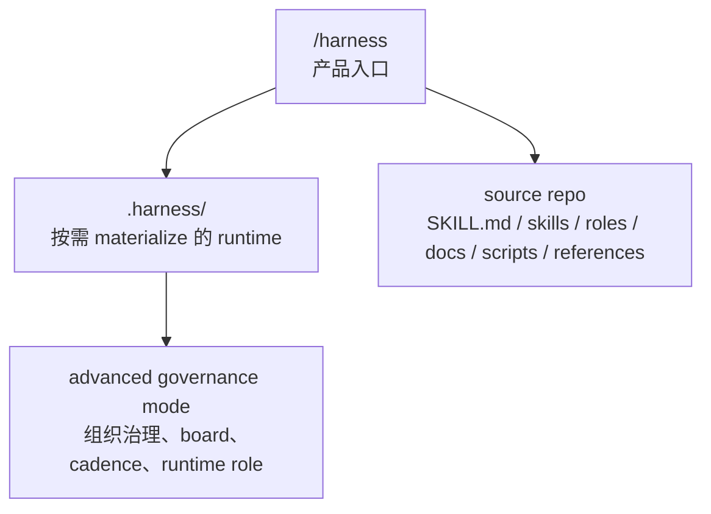
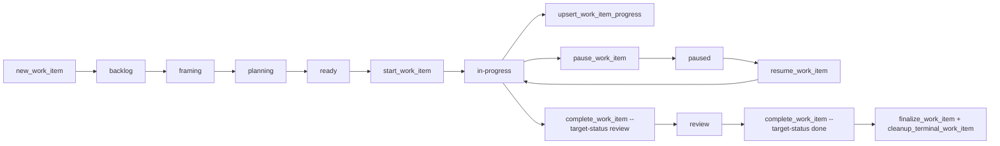

# Harness

`harness` 不是一个普通的“技能合集”仓库，它更像一套给 agent 用的公司操作系统。

如果把它想成一家公司的运作：

- `SKILL.md` 是前台总入口，决定新人先进哪扇门。
- `roles/` 是岗位说明书，定义谁该负责什么、不能做什么。
- `skills/` 是会议和工作流 SOP，决定什么时候该开哪种会、产出哪种文档。
- `docs/workflows/` 是制度和流程章程，定义 gate、升级条件、写回边界。
- `docs/templates/` 是标准表单，保证每次开会、研究、决策、复盘都有统一格式。
- `scripts/` 是执行部门，真正去落状态变更、写账本、做校验、跑审计。
- `.harness/` 是 consumer repo 里的真实办公室，任务、进度、产物、状态都在这里运行。

这个仓库本身只是 `harness` 的 source repo。它定义制度、合同和执行器，但不保存任何 consumer repo 的 live runtime truth。

## 一句话心智模型

`harness = /harness 入口 + 按需 materialize 的 .harness runtime + 可选的 advanced governance mode + 一套 shell-native 的状态机与审计系统`

它的目标不是“多放一点文档”，而是把 agent 的工作变成：

- 可恢复
- 可审计
- 可暂停/恢复
- 可写回证据与决策
- 必要时可升级成治理层，而不是一开始就铺满公司树

## 四层分层

这套系统只承认四层，没有第三种暧昧中间层。



对应关系见：

- `references/layering.md`
- `references/runtime-workspace.md`
- `references/contracts/minimum-core-runtime-tree.toml`
- `references/top-level-surface.md`

### 1. `/harness` 入口层

这是用户心智里的主入口，不要求先安装一整套 runtime 才能开始工作。

### 2. `.harness/` 运行层

只有任务需要跨回合追踪、恢复、reviewable artifact 或正式 writeback 时，才按需 materialize。

最小 runtime 的 canonical 结构是：

```text
.harness/
  manifest.toml
  entrypoint.md
  README.md
  current-task
  tasks/
    WI-xxxx/
      task.md
      progress.md
      refs/
      working/
      outputs/
      closure/
      history/
        transitions/
  archive/
    tasks/
  locks/
```

### 3. advanced governance mode

只有显式升级后，才允许长出：

- `.harness/workspace/state/boards/`
- `.harness/workspace/status/digests/`
- `.harness/workspace/status/process-audits/`
- `.harness/workspace/status/snapshots/`
- `.harness/workspace/research/dispatches/`
- `.harness/workspace/decisions/log/`
- `.harness/workspace/roles/`
- `.harness/workspace/departments/...`

默认不长。

### 4. source repo 维护层

当前仓库只负责：

- 定义 canonical skill/role/workflow/reference
- 提供 shell-native runtime scripts
- 提供 audit/validation/materialization 能力
- 保存 active specs 和 archive

它不负责：

- 任何 consumer repo 的 live `.harness/`
- 任何 provider-owned surface 的唯一真相
- consumer 根目录的 `AGENTS.md / CLAUDE.md / GEMINI.md`

## 如果把 Harness 当成一家公司

### 董事会和管理层

- `Founder / Principal`
  最终拍板 go / pause / kill。
- `General Manager / Chief of Staff`
  把 Founder 的意图收敛成单一问题，安排角色参与，控制节奏。
- `Product Thesis Lead`
  负责把问题定义锋利化。
- `Knowledge & Memory Lead`
  负责 source of truth、writeback 和归档卫生。
- `Workflow & Automation Lead`
  负责 skill、script、adapter 和自动化边界。
- `Risk & Quality Lead`
  负责红队、review gate、stop-the-line。
- `Compounding Engineering Lead`
  负责复盘、流程复利和制度改进。
- `Runtime Role Manager`
  只在批准后执行 runtime role mutation。

组织图在：

- `docs/organization/org-chart.md`
- `docs/organization/company-os-runtime-data-map.md`

### 各类文件在公司里的角色

| 目录/文件 | 在“公司”里的角色 | 主要作用 |
| --- | --- | --- |
| `SKILL.md` | 总前台 | 告诉 agent 这是 harness 任务，不是产品功能任务 |
| `roles/*.md` | 岗位 JD + 权责边界 | 定义角色职责、不能做的事、必须优先读什么 |
| `skills/*/SKILL.md` | 会议 SOP / 工作手册 | 定义何时触发哪种工作流与文档输出 |
| `docs/workflows/*.md` | 公司制度 | 定义 gate、生命周期、路由、升级、审计规则 |
| `docs/templates/*.md` | 标准表单 | 统一 founder brief、decision pack、dispatch、retro 等格式 |
| `scripts/*.sh` | 执行部门 | 真的改状态、写任务、写事件、做校验 |
| `references/*.md` | 宪法/合同 | 规定 layering、runtime contract、top-level boundary |
| `.harness/tasks/WI-xxxx/task.md` | 案件主档 | 当前任务的身份、状态、目标、依赖、链接产物 |
| `.harness/tasks/WI-xxxx/progress.md` | 交接班记录 | 当前 focus、下一条命令、恢复提示 |
| `.harness/tasks/WI-xxxx/history/transitions/*.md` | 合规流水账 | 每次状态迁移的 append-only 审计事件 |
| `.harness/workspace/state/boards/*.md` | BI 看板 | 从 task truth 派生出的只读视图，不是 source of truth |

## 一条任务是怎么跑完整链路的

下面这条链，才是 `harness` 的真正主产品。



### 第 0 步：决定要不要 materialize runtime

规则见 `docs/workflows/document-routing-and-lifecycle.md`。

如果任务一轮能自然收口，就保持 ephemeral session。

如果任务需要：

- 跨回合恢复
- review
- decision writeback
- research evidence
- 可审计状态

就 materialize `.harness/`。

脚本入口：

- `scripts/materialize_runtime_fixture.sh`
- `scripts/run_state_validation_slice.sh`

### 第 1 步：新建 work item

入口：

- `scripts/new_work_item.sh`

它会：

1. 创建 `WI-xxxx`
2. 写 `.harness/tasks/WI-xxxx/task.md`
3. 初始化状态为 `backlog`
4. 立刻写第一条 transition event
5. 在没有当前焦点时认领 `.harness/current-task`

`task.md` 是运行态唯一主档，里面有这些关键字段：

- `Status`
- `State version`
- `Last operation ID`
- `Objective`
- `Ready criteria`
- `Done criteria`
- `Required artifacts`
- `Linked artifacts`
- `Interrupt marker`
- `Resume target`
- `Blocked by`
- `Current blocker`
- `Next handoff`

### 第 2 步：选单和开单

入口：

- `scripts/select_work_item.sh`
- `scripts/open_current_work_item.sh`
- `scripts/work_item_ctl.sh status`

这一步像总经理在看当前工单池：

- `select_work_item.sh` 负责在 open items 里挑“当前最该处理的那个”
- `open_current_work_item.sh` 负责把它的上下文、阻塞原因、推荐动作、progress 同步状态一起展开

选择逻辑不是随机的，它会考虑：

- status 优先级
- priority
- founder escalation
- blocked by
- interrupt marker
- department participation
- `.harness/current-task` 焦点

也就是说，`current-task` 是焦点提示，不是第二真相；真正的真相仍然在 `task.md`。

### 第 3 步：从 backlog 推进到 ready

统一底层入口：

- `scripts/transition_work_item.sh`

高层阶段流转：

- `backlog -> framing`
- `framing -> planning`
- `planning -> ready`

进入 `ready` 前必须满足最小条件：

- `Objective` 不为空
- `Ready criteria` 不为空
- required department 参与记录满足约束

所以 `ready` 不是口头说“差不多可以”，而是脚本强校验过的执行就绪态。

### 第 4 步：正式开工

入口：

- `scripts/start_work_item.sh`
- `scripts/work_item_ctl.sh start`

它只允许把 `ready` 项推进到 `in-progress`，同时：

- 写 transition event
- 更新 `State version`
- 更新 `Last operation ID`
- 把该任务认领为 `.harness/current-task`
- 检查 `progress.md` 是 `missing / stale / unlinked / current`

这像公司里把一张工单从“准备好了”正式转成“有人在做”。

### 第 5 步：写 progress，保证能恢复

入口：

- `scripts/upsert_work_item_progress.sh`

文档协议：

- `docs/workflows/work-item-progress-protocol.md`

`progress.md` 只回答四件事：

- 当前在做什么
- 下一条命令是什么
- 从哪里继续
- 此刻对应哪一版状态快照

它不是第二个 task truth，不是研究 memo，也不是叙事日志。

它的字段里会带：

- `Status snapshot`
- `State version snapshot`
- `Last operation ID snapshot`

这样恢复时可以知道 progress 是否已经 stale。

### 第 6 步：中断、暂停、恢复

入口：

- `scripts/pause_work_item.sh`
- `scripts/resume_work_item.sh`

制度：

- `docs/workflows/work-item-interrupt-protocol.md`

关键规则非常硬：

- `paused` 是唯一合法的 interrupt 承载状态
- pause 必须带 `Interrupt marker`
- pause 必须记录 `Resume target`
- resume 只能回到预先声明的 `Resume target`
- pause/resume 都必须写正式 transition event

当前允许的 interrupt marker：

- `manual-review-required`
- `founder-review-required`
- `risk-review-required`

这像公司里正式挂起一张工单，不是发一句“先等等”，而是写清楚“等谁、等什么、恢复后回到哪一步”。

### 第 7 步：进入 review 和 terminal close

入口：

- `scripts/complete_work_item.sh`
- `scripts/finalize_work_item.sh`
- `scripts/cleanup_terminal_work_item.sh`
- `scripts/work_item_ctl.sh close`

关闭链路分两段：

1. `in-progress -> review`
2. `review -> done`

或在任何允许的 open 状态转 `killed`。

`finalize_work_item.sh` 不只是改状态，它还会调用 `cleanup_terminal_work_item.sh` 做 terminal cleanup：

- 清空 `Blocked by / Blocks / Current blocker / Next handoff`
- 清空 interrupt metadata
- 清理 `current-task` 指针
- 保留最终 transition ledger

也就是说，任务“关单”不是把文件删掉，而是把它收束成可追溯、可复盘的 terminal state。

## 产物链路：那些 md 和 sh 到底怎么连起来

这是仓库最容易看花眼的地方。可以用一句话记住：

`workflow 文档定义什么时候该产出什么，template 定义产物长什么样，script 决定把它写到哪里并怎么挂到 task 上，skill 决定什么时候触发这套动作。`

### 研究与决策类

| 业务动作 | skill / workflow | template | script | 默认落点 |
| --- | --- | --- | --- | --- |
| 派研究任务 | `skills/research-dispatch` + `docs/workflows/internal-research-routing.md` | `docs/templates/research-dispatch.md` | `scripts/new_research_dispatch.sh` | `.harness/tasks/<id>/working/` |
| 写 source note | `docs/workflows/volatile-research-default.md` | `docs/templates/source-note.md` | `scripts/new_source_note.sh` | `.harness/tasks/<id>/refs/sources/` |
| 写 research memo | `skills/research-memo` | `docs/templates/research-memo.md` | `scripts/new_research.sh` | `.harness/tasks/<id>/refs/` |
| 写 decision pack | `skills/decision-pack` + `docs/workflows/decision-workflow.md` | `docs/templates/decision-pack.md` | `scripts/new_decision.sh` | `.harness/tasks/<id>/refs/` |
| 写 checkpoint | `skills/memory-checkpoint` + `docs/workflows/task-artifact-routing.md` | 内置 snapshot 模板 | `scripts/new_checkpoint.sh` | open task 写 `outputs/`，terminal task 写 `closure/` |
| 提角色变更 proposal | `docs/workflows/post-acceptance-compounding-loop.md` | `docs/templates/role-change-proposal.md` | `scripts/new_role_change_proposal.sh` | `.harness/tasks/<id>/closure/` |

### Founder / meeting 类

| meeting skill | 负责什么 | 下游制度 |
| --- | --- | --- |
| `meeting-router` | 把 Founder-facing 请求路由到唯一一种 canonical meeting | `docs/workflows/founder-meeting-taxonomy.md` |
| `founder-brief` | 把 Founder 输入收束成问题定义 | `docs/templates/founder-brief.md` |
| `vision-meeting` | 讨论 vision、边界、价值 | `docs/templates/vision-meeting-brief.md` |
| `requirements-meeting` | 把 vision 翻译成范围和验收标准 | `docs/templates/requirements-meeting-brief.md` |
| `acceptance-review` | Founder 验收 runnable slice | `docs/templates/acceptance-review-brief.md` |
| `brainstorming-session` | 发散候选方向，不直接当正式决策 | `docs/templates/brainstorming-notes.md` |
| `governance-meeting` | 处理公司运行和流程治理问题 | `docs/templates/governance-meeting-brief.md` |

`meeting-router` 的意义很大：它防止一次输出混成“改愿景 + 做验收 + 开治理会”的大杂烩。

### governance / cadence 类

| 产物 | skill / workflow | 默认落点 |
| --- | --- | --- |
| company daily digest | `skills/daily-digest` + `docs/workflows/process-compounding-cadence.md` | `.harness/workspace/status/digests/` |
| process audit / retro | `skills/process-audit`、`skills/retro` | `.harness/workspace/status/process-audits/` |
| governance surface audit | `skills/os-audit` + `docs/workflows/governance-surface-audit.md` | governance audit outputs |
| board refresh | `docs/workflows/board-refresh-ledger.md` | `.harness/workspace/state/boards/` |

这些都只在 `advanced governance mode` 下才值得出现。

## 状态控制系统：这家公司为什么不会乱

`harness` 真正精致的地方，不是“文档很多”，而是它有一套接近财务内控的状态系统。

### 1. 写状态必须署名

多数状态写操作都要求：

- `STATE_ACTOR` 必填
- `STATE_INVOKER` 会被记录

这相当于每次重要操作都要留下“是谁通过哪个入口做的”。

### 2. 写状态前先拿锁

`scripts/lib_state.sh` 里有两类锁：

- runtime-global lock
- work-item lock

锁目录在：

- `.harness/locks/`

作用是避免并发写同一任务或同一 runtime 时踩穿状态。

### 3. 用版本号做乐观并发控制

关键脚本都会要求：

- `--expected-from-status`
- `--expected-version`
- 可选 `--operation-id`

如果你以为任务还在 `ready`，但实际上别人已经把它推到 `in-progress`，脚本会直接拒绝，不让脏写发生。

### 4. 每次迁移都写 append-only ledger

transition event 不只是“记一条日志”，它是正式账本：

- 落点：`.harness/tasks/<id>/history/transitions/TX-*.md`
- 包含 `From / To / Actor / Reason / Operation ID / Version before / Version after / Interrupt marker / Resume target / Invoker`
- 带 `Prev event` 与 `Prev event hash`
- 带自身 `Event hash`

这让状态历史天然可追溯、可校验、可审计。

### 5. 事件有分类，不是所有迁移都一锅粥

允许的 trace event type 包括：

- `state-transition`
- `artifact-link`
- `approval-pause`
- `resume`
- `field-update`
- `terminal-cleanup`
- `schema-migration`
- `blocker-release`
- `board-refresh`

也就是说，系统分得清：

- 正常推进
- 正式暂停
- 正式恢复
- 只是补字段
- 只是做 terminal cleanup

### 6. `current-task` 只是执行焦点，不是第二真相

这点是整个系统很漂亮的一个边界。

`.harness/current-task` 只表示“当前执行焦点是谁”，不是任务状态的权威来源。

因此：

- `start`
- `resume`
- `pause` 后继续保留执行焦点

可以认领或保持 `current-task`。

但这些非执行写回默认不能偷走焦点：

- research dispatch
- source note
- decision pack
- checkpoint
- 给别的 task 补证据

这条规则由 `task-artifact-routing.md` 和 `run_state_validation_slice.sh` 明确保护。

### 7. progress 也必须和 task truth 同步

`progress.md` 不只是存在就算数，它还有 4 种同步状态：

- `missing`
- `unlinked`
- `stale`
- `current`

`open_current_work_item.sh` 和 `start_work_item.sh` 会把这个状态直接暴露出来，逼你先修恢复协议，再继续执行。

## 默认状态机

合法状态：

- `backlog`
- `framing`
- `planning`
- `ready`
- `in-progress`
- `review`
- `paused`
- `done`
- `killed`

默认开放态：

- `backlog`
- `framing`
- `planning`
- `ready`
- `in-progress`
- `review`
- `paused`

合法迁移大致是：

```text
backlog -> framing | paused | killed
framing -> planning | paused | killed
planning -> ready | framing | paused | killed
ready -> in-progress | planning | paused | killed
in-progress -> review | planning | paused | killed
review -> done | planning | paused | killed
paused -> framing | planning | ready | in-progress | killed
```

这里最关键的设计有两个：

1. `review` 被建模成正式状态，不是口头阶段。
2. `paused` 不是临时备注，而是正式状态协议。

## advanced governance 是怎么长出来的

默认最小 runtime 只解决“单任务可恢复、可追踪、可关单”。

只有在显式升级到治理模式后，才值得谈：

- boards
- departments
- digest / audit / snapshots
- governance meetings
- runtime-local roles

### board 为什么不是 source of truth

`scripts/refresh_boards.sh` 会从所有 `task.md` 派生：

- company board
- founder board
- department board

这些 board 都标明：

- `Derived only: true`
- `Source of truth: .harness/tasks/*/task.md`

所以 board 更像公司的 BI 大屏，而不是业务主表。

### role 为什么分 source baseline 和 runtime-local

这套系统强行把“组织基线”和“某个 repo 的临时专岗”拆开：

- source baseline role 写在 `roles/`
- consumer runtime role 写在 `.harness/workspace/roles/`

这样不会因为某个项目一时需要一个专岗，就污染整个 framework source repo。

### 角色新增必须走“人事流程”

真正漂亮的是这条链：

```text
completion candidate
-> acceptance
-> post-acceptance compounding review
-> role change proposal
-> runtime_role_manager execution
```

对应文件和脚本：

- `docs/workflows/post-acceptance-compounding-loop.md`
- `docs/templates/role-change-proposal.md`
- `scripts/new_role_change_proposal.sh`
- `scripts/runtime_role_manager.sh`

其中：

- `Compounding Engineering Lead` 负责判断要不要改角色
- `Runtime Role Manager` 只负责执行，不负责拍脑袋决定长角色

这就像公司里“组织设计”和“人事落地”是两条职责线，不能混。

### runtime role mutation 的安全边界

`runtime-role-manager` 这个角色本身带 `policy_*` frontmatter，配合：

- `scripts/enforce_role_policy.sh`
- `scripts/runtime_role_manager.sh`
- `scripts/new_role.sh`
- `scripts/edit_role.sh`
- `scripts/audit_role_schema.sh`

它会机械检查：

- entrypoint 对不对
- action 对不对
- stage 对不对
- proposal 对不对
- write root 对不对

也就是说，这不是“大家约定一下不要乱写”，而是在逐步把高信任动作变成脚本级约束。

## 哪些文件该先读，才能最快看懂整个系统

### 如果你想 10 分钟内看懂全局

按这个顺序：

1. `SKILL.md`
2. `references/layering.md`
3. `references/runtime-workspace.md`
4. `docs/project-structure.md`
5. `docs/workflows/document-routing-and-lifecycle.md`
6. `docs/organization/org-chart.md`
7. `scripts/work_item_ctl.sh`
8. `scripts/lib_state.sh`

### 如果你只想看任务状态机

按这个顺序：

1. `scripts/new_work_item.sh`
2. `scripts/select_work_item.sh`
3. `scripts/open_current_work_item.sh`
4. `scripts/start_work_item.sh`
5. `scripts/transition_work_item.sh`
6. `scripts/pause_work_item.sh`
7. `scripts/resume_work_item.sh`
8. `scripts/complete_work_item.sh`
9. `scripts/finalize_work_item.sh`
10. `scripts/upsert_work_item_progress.sh`
11. `docs/workflows/work-item-progress-protocol.md`
12. `docs/workflows/work-item-interrupt-protocol.md`
13. `docs/workflows/work-item-trace-taxonomy.md`

### 如果你只想看治理升级

按这个顺序：

1. `docs/workflows/decision-workflow.md`
2. `docs/workflows/task-artifact-routing.md`
3. `docs/workflows/post-acceptance-compounding-loop.md`
4. `docs/workflows/consumer-runtime-routing.md`
5. `roles/runtime-role-manager.md`
6. `scripts/runtime_role_manager.sh`
7. `scripts/refresh_boards.sh`

## 推荐命令面

日常高层控制，优先用：

```bash
./scripts/work_item_ctl.sh status
./scripts/work_item_ctl.sh start
./scripts/work_item_ctl.sh pause --expected-from-status in-progress --expected-version 3 --interrupt-marker risk-review-required WI-0001
./scripts/work_item_ctl.sh resume --expected-version 4 WI-0001
./scripts/work_item_ctl.sh close --target-status review
```

底层精确控制，再直接用：

```bash
STATE_ACTOR=codex ./scripts/transition_work_item.sh --expected-from-status planning --expected-version 3 WI-0001 ready
STATE_ACTOR=codex ./scripts/upsert_work_item_progress.sh --expected-version 5 WI-0001 "整理状态协议" "./scripts/work_item_ctl.sh close --target-status review" "下一轮先审查 transition ledger"
```

source repo 自检：

```bash
./scripts/validate_source_repo.sh
./scripts/audit_role_schema.sh
./scripts/run_governance_surface_diagnostic.sh --mode source
```

consumer runtime 自检：

```bash
./scripts/validate_workspace.sh --mode core
./scripts/audit_state_system.sh --mode core
./scripts/audit_document_system.sh
./scripts/validate_freshness_gate.sh --staged
```

如果已升级到 governance：

```bash
./scripts/validate_workspace.sh --mode governance
./scripts/audit_state_system.sh --mode governance
./scripts/run_governance_surface_diagnostic.sh --mode consumer
```

## 这套系统真正想解决的不是“文档少”，而是这几个问题

1. agent 做到一半，下轮怎么无损恢复？
2. 任务暂停时，系统怎么知道是在等 Founder、等人工 review，还是等风险审查？
3. 决策、研究、checkpoint 到底应该贴着 task 存，还是写到公司级 workspace？
4. board 是派生视图，还是又偷偷变成 source of truth？
5. 某个 repo 的专属角色，什么时候才值得从临时分工变成正式 runtime role？

`harness` 的答案基本都一致：

- 默认简单
- 默认 task-local first
- 默认 shell-native
- 默认 append-only ledger
- 默认显式 promotion
- 默认把“决定”和“执行”拆开

## 最后用一句话总结

`harness` 不是“让 agent 多做点事”的工具，而是“让 agent 像一家纪律严明的小公司那样做事”的运行框架。

它把：

- 入口
- 角色
- 会议
- 表单
- 脚本
- 状态机
- 审计账本
- 治理升级

收敛成一条能真正跑起来、暂停后还能接着跑、做错了还能追责、做对了还能复利的工作链。
