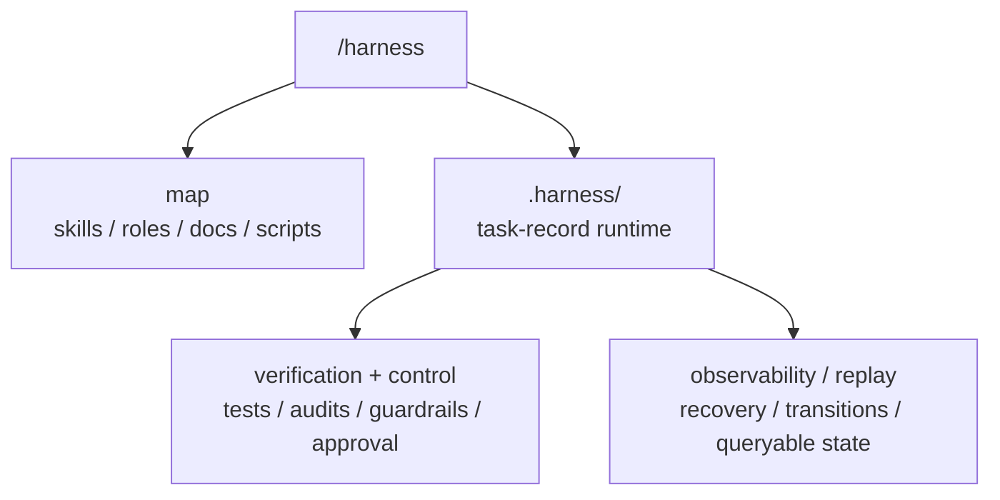

# Harness

`harness` 不是普通的技能仓库，也不该先被理解成一个“公司治理系统”。

它的 canonical 定位是：

```text
agent execution substrate =
  /harness 入口
  + agent-readable repo map
  + minimal resumable task runtime
  + deterministic validation/gates + evals
  + observability/replay
  + control surfaces
```

换句话说，它首先是给 agent 用的执行底座，不是组织结构投影。

## Source Repo Scope

这个 source repo 负责六件事：

1. 定义入口：`SKILL.md`
2. 定义能力包：`skills/`
3. 定义责任与路由基线：`roles/`、`docs/workflows/`
4. 定义合同：`references/`
5. 提供执行器：`scripts/`
6. 提供可验证、可审计、可恢复的读取与写回边界

它不保存任何 consumer repo 的 live runtime truth。
真正运行时的任务状态，只会按需 materialize 到 consumer repo 的 `.harness/`。

## 第一性原理

一个 production-grade agent harness，默认必须先解决：

1. agent 能不能快速读懂当前 repo
2. 长任务在跨 session / 跨 context window / 工具失败后，能不能从中断点恢复
3. agent 的动作有没有可重复验证的反馈回路
4. 状态为什么改变、改变到了哪里，能不能回放与解释
5. 高风险动作有没有足够硬的控制面

因此，`harness` 的默认产品心智不是“模拟一家公司”，而是“让 agent 在 repo 内可读、可做、可恢复、可验证、可追踪”。

## 结构心智

`harness` 里默认只有三类 active source 对象：

| Layer | Meaning | Canonical Surface |
| --- | --- | --- |
| `root` | 共享底座、总入口、总规则 | `SKILL.md` + core dirs |
| `skills` | 自包含能力 bundle | `skills/*` |
| `roles` | 责任主体与默认路由基线 | `roles/*` |

其中 `root` 的 core dirs 指：

- `docs/`
- `references/`
- `roles/`
- `scripts/`

一句话：

1. `skill` 不是 agent
2. `role` 不是 skill
3. 目录树不等于组织图
4. 能力结构是图，不是公司层级
5. runtime primitive 先于任何协作叙事

## 一句话心智模型

```text
harness =
  /harness 入口
  + agent-readable repo map
  + minimal task-record runtime
  + deterministic validation/gates + evals
  + observability/replay
  + control surfaces
```

这几个词的优先级不要搞反：

1. 先有 legibility
2. 再有 runtime continuity
3. 再有 verification loops
4. 再有 observability / replay
5. 最后才是需要时才显式启用的共享写回或本地扩展

## 三层分层



对应参考：

- [references/layering.md](/Users/vx/WebstormProjects/harness/references/layering.md)
- [references/runtime-workspace.md](/Users/vx/WebstormProjects/harness/references/runtime-workspace.md)
- [references/top-level-surface.md](/Users/vx/WebstormProjects/harness/references/top-level-surface.md)
- [task-record-runtime-tree-v2.toml](/Users/vx/WebstormProjects/harness/references/contracts/task-record-runtime-tree-v2.toml)

## Skills Are Bundles

`skills/*` 是最重要的能力面，应该坚持自包含。

如果某个 capability 专用的文档、模板、脚本、rubric 只服务一个 skill，就优先放进该 skill：

```text
skills/<bundle-slug>/
  SKILL.md
  manifest.toml
  refs/
  templates/
  scripts/
```

不要把只服务一个 skill 的 `templates / refs / scripts` 回流到 root。

root 只保留：

1. 全局 contract
2. 全局 workflow
3. 共享脚本基础设施
4. baseline role 定义
5. 总导航与审计入口

## Skills Need Progressive Disclosure

`skills/*` 不只是“自包含”，还应当满足“窄触发、晚展开”。

一个好的 skill bundle，默认应做到：

1. `SKILL.md` 先回答触发条件、目标产出、读取顺序
2. 详细说明、模板、脚本放在 `refs/`、`templates/`、`scripts/`，只在命中 skill 后按需读取
3. skill 描述负责路由，skill 内部材料负责深度，不把所有上下文常驻在 root 入口
4. skill 的目标是压缩默认上下文，而不是重新制造一个巨型总提示词
5. 若 skill 会驱动 subagent / hooks / MCP，
   还应显式声明 input / output contract、
   tool scope、memory scope、side-effect envelope
   与 verification expectation
6. skill bundle 是 capability package，
   不是 durable memory store；
   skill 运行中产出的决定、证据与恢复信息，
   若会影响任务执行，
   必须回落到 `task.md` / `attachments/` / `history/`
7. 常驻 `rules / policy / project memory` 与按需 skill 展开必须分层；
   前者定义默认行为基线，后者提供窄任务能力，不互相替代
8. skill / subagent 的默认 handoff 应是最小必要、结构化、
   可审计的 capability packet，不把 parent session transcript、
   全量 system prompt 或临时上下文整包继承
   - subagent 默认首先是 context-isolation / scoped-capability primitive，
     不自动等于 sustained parallelism；
     若任务会跨 session、超出主会话窗口，或需要长时间独立推进，
     就升级为 task-local artifact + separate session / worktree claim，
     不在单一 transcript 里无限 fan-out
   - 若某个 runtime 在未显式声明 tool scope /
     permission scope 时，
     会让 subagent 继承 parent 的全量工具或权限，
     就必须把“省略配置”本身视为 capability grant；
     默认仍显式写 allowlist / denylist，
     不把 inherited-by-default 误当成安全默认值
   - 若 subagent 会产生大体积、高保真或结构化结果，
     优先直写 task-local artifact / attachment，再回传轻量 handle、
     locator 或摘要；
     不让多级 coordinator 用 transcript 做
     “口耳相传” copy chain
9. skill 默认属于 versioned instruction surface，
   不是自动获得高优先级的 enforced policy
   channel；
   即便某个 runtime 会把 skill metadata
   常驻注入 prompt，或在命中后读取
   `SKILL.md`，它本质上仍是
   capability guidance，不是机械约束
10. 若某条规则的违规成本高，
    必须继续下沉到
    `hooks / managed policy / tool approval /
    allowlist / typed schema`
    这类 enforcement boundary，
    不能只靠 skill prose 兜底
11. remote / marketplace / user-supplied skill
    默认先视为潜在不可信的
    instruction + code surface；
    只有经过 curate / review /
    version pin 后，
    才应进入可执行 catalog，
    不把“终端用户可选”误当成
    安全基线
12. subagent / skill-local persistent memory
    若会被自动注入 prompt，
    或因 memory 管理而默认开启
    Read / Write / Edit
    这类能力，
    就应同时视为
    instruction surface +
    persisted data +
    capability grant；
    它的 scope、retention、
    versioning 与审计边界
    必须显式管理，
    但其中 durable facts
    仍不得替代 canonical task truth

## Survivor-First Compaction

agent 可以在探索阶段快速做加法，但 `harness` 的 active surface 不能因此持续膨胀。

默认原则：

1. 探索可以是 additive，active surface 必须是 subtractive
2. 每个 durable write 都必须先回答 disposition：
   - 更新现有 canonical surface
   - 写 task-local artifact
   - 显式 promote 到 shared writeback
   - 进入 cold archive
3. 若一个新文件只是重复转述旧推导，而不是新增承重信息，就不应进入 active surface
4. checkpoint / compaction memo / status snapshot
   的职责不是再造一份总结，
   而是把当前工作面压缩成更小的 survivor state
5. 历史可以为审计与回放保留，但默认必须退出 working set

这里的 `承重` 至少指以下任一职责：

1. 当前任务恢复离不开它
2. 当前控制面、路由面或验证面离不开它
3. 它比回读原始 lineage 更便宜
4. 它包含不可廉价重建的证据、决策或边界

### Entropy Budget Is A Gate

source repo 的 active surface 不能只靠“定期 review”来控膨胀，
还必须有硬预算。

默认设计：

1. active source 受
   `references/contracts/active-surface-entropy-budget-v1.toml`
   约束
2. budget 按 active surface 计数，
   默认不把 `references/archive/`
   计入 source working set
3. 若 source 变更导致 budget breach，
   默认进入 `compaction-only mode`
   - 只允许 `compress / merge /
     archive / delete`
   - 或做必须的 bug fix、
     contract tightening、
     mechanical enforcement
4. 提高 budget 不是普通实现细节，
   而是 control-surface change；
   需要显式 reviewable rationale，
   不允许靠连续提交静默抬高
5. README 的增长也属于
   active-surface entropy；
   若 README 变大但默认读序
   没更短、更稳、更少歧义，
   默认视为退化

## README Is A Compaction Boundary

`README.md` 不只是介绍页，它还是 source repo 的默认读序入口与 repo-level compaction boundary。

这意味着 README 的演化默认也必须做减法：

1. 新心智进入 README 时，应优先改写、压缩或替换旧段落，而不是叠加平行模型
2. 若一个概念已经有 canonical 表达，后续更新应优先 patch 原位置，而不是再长出一个旁支文档
3. 若必须新增 surface，就应同时回答谁被 supersede、谁进 archive、谁只保留 redirect
4. README 只保留跨 skill、跨 workflow 都承重的规则；task-specific、skill-specific、历史推导性的内容应下沉到对应文档
5. 自动化在更新 README 时，默认目标不是“多写一些解释”，而是让默认读取路径更短、更稳、更少歧义
6. 若 active surface 增长但没有同步发生 compress / merge / archive，这应被视为 repo entropy 增长，而不是自然演化
7. README update 也受
   active-surface entropy budget
   约束；不能把它当成无限扩写的
   缓冲层

## Frontier Priority

如果按 2025-2026 社区里更稳的 harness 经验排序，优先级应是：

1. agent legibility
   - 入口短
   - 读取顺序稳定
   - 文档可按需展开
2. resumability
   - 长任务跨 context window 仍可恢复
   - 当前 focus、next command、history 可回放
   - `task truth`、`execution checkpoint`、`transport state` 必须分层
   - static prefix、tool schema / order、
     sandbox / cwd / approval banner
     这类 prompt-shape surface
     在长会话里应尽量稳定；
     静态内容放前缀，变化量追加到尾部，
     不把 cache / prefix consistency
     当成纯性能细节
3. deterministic verification
   - tests、audit、freshness gate、review loop 必须可重复执行
   - offline regression slice 与 online sampling / feedback loop
     要闭环，但线上观测不替代 deterministic gate
4. observability and replay
   - state transition 要能解释
   - query surface 要能回放当前工作面
   - telemetry / tracing 的 retention、
     redaction、flush boundary 必须显式
   - recovery 写回不能形成第二套平行账本
5. control surfaces
   - approval、policy、guardrail、permission boundary 必须清晰

## Runtime Primitives First

`harness` 的默认 runtime，不应先从组织层或协作树出发，而应先从几个更底层的 primitive 出发：

1. `task record`
   - 当前任务为何存在、处于什么状态、下一步做什么
2. `attachments`
   - task-local 正式材料与证据
3. `transitions`
   - 状态迁移与可审计历史
4. `locks`
   - 受控状态修改期间的并发保护
   - 默认应具备 owner、lease / expiry
     与 stale reclaim 语义
5. `execution checkpoints`
   - 可选的 engine-local step snapshots，
     用于 durable execution、resume、fork 与 pending writes
   - checkpoint 不是单一语义；durability / flush boundary 应显式声明
     （例如 sync / async / exit 这类差异），不把“有 checkpoint”
     与“crash-safe 到哪一步”混成一句话
6. `query`
   - 面向 agent 的读取视图，而不是账本本体
7. `validation`
   - 对 runtime contract、文档系统、freshness 与状态机的可重复验证
8. `control surfaces`
   - approval、policy、guardrails、tool / permission boundary
   - tool name、description、argument schema、output contract
     也是 agent-facing runtime surface；默认短、明确、typed，
     大输出优先返回 handle / locator / page token，不把大 blob 直接塞回上下文
   - tool annotations / execution metadata
     （如 read-only / destructive /
     idempotent / open-world hints，
     以及 `taskSupport` 这类
     long-running declaration）
     也属于 planning + safety
     surface；但来自 untrusted
     server 的 hint 默认只辅助
     UX / routing，不直接充当
     enforcement 依据
9. `budget / termination`
   - bounded autonomy：`max turns / iterations`、wall-clock timebox、
     tool / write budget、pause / cancel / kill semantics
10. `wait / wakeup`
    background jobs、human approval、webhook、async tool work 等外部等待必须显式物化，
    而不是依赖活着的线程、socket 或 stream。wait record 默认应带 wakeup handle、
    deadline / SLA、resume / cancel semantics。若 wakeup 来自 webhook / queue /
    async callback，默认还应带 dedupe / idempotency key，并按 at-least-once delivery
    设计恢复链路，不把“只会送达一次”当作前提。
    对 human approval / interrupt / async callback，pending work 还应带
    stable operation id（如 `approval_id` / `interrupt_id` / `tool_call_id`）
    与 version marker；恢复决策按 ID 配对，不按 UI 顺序、列表位置或
    transcript 位置猜测，避免并行中断或长时间挂起后的错配。
    若底层 provider / protocol
    已返回 task object /
    background handle
    （如 `task_id`、poll interval、
    TTL / expiry、stream cursor、
    cancel handle），
    默认优先复用这些
    receiver-generated handle
    回写 recovery / wait record，
    不在本地 transcript 外
    再造一套 shadow polling state

## Bootstrap 不是稳态循环

frontier 长任务 harness，越来越常见的做法是把
“第一次把工作面立起来”和
“后续每轮稳定推进”分开建模。

1. bootstrap session 的职责是 materialize 最小运行面：
   - task record、acceptance ledger、
     baseline smoke test、必要脚本
     与恢复入口
   - 若输入规范可拆成 end-to-end
     feature / acceptance list，
     bootstrap 默认先落一份
     结构化、可更新的 ledger；
     后续回合主要更新 status /
     evidence / owner，不在每轮重写
     narrative spec
2. steady-state session 的职责是消费同一份 task truth：
   - 先读 `task.md`、`## Recovery`、最近的 transition / progress，
     再跑一个廉价 baseline check，先确认环境没有 undocumented drift
3. 若 feature / acceptance progress
   需要跨回合累计，
   优先写成 task-local、结构化、可机读的 ledger，不要只写 narrative prose、
   provider transcript 或零散聊天结论；对这类 ledger，默认优先 update-only
   的 status / checklist 与 evidence reference，不在每轮重写整份 spec 或完成标准
   - 对会被 agent 高频改写的
     feature / acceptance ledger，
     默认优先 typed schema
     （如 JSON / TOML）
     或其他 update-friendly 结构，
     不让自由 prose 承担
     mutable control plane
4. 每次长回合结束时，
   默认至少留下：可执行的 next command、已验证的完成边界、
   reviewable diff / checkpoint / acceptance status 之一
5. bootstrap artifact 与 steady-state progress
   都服务 recovery，
   但都不应另起第二本状态账

## Capability Families

当前 skills 更适合按执行能力理解，而不是按组织会议理解：

1. intake and framing
   - `founder-brief`, `meeting-router`, `brainstorming-session`, `vision-meeting`
2. discovery and evidence
   - `research`, `capability-scout`
3. scope and decision
   - `requirements-meeting`, `decision-pack`, `acceptance-review`
4. memory and writeback
   - `memory-checkpoint`
5. audit and compounding
   - `process-audit`, `os-audit`

## 最小 Runtime

v2 的最小 runtime 已经收敛到 flat task-record：

```text
.harness/
  manifest.toml
  entrypoint.md
  README.md
  tasks/
    WI-xxxx/
      task.md
      attachments/
      closure/
      history/
        transitions/
  locks/
```

核心约束：

1. `task.md` 是唯一任务执行真相
2. Recovery 写在同一个 `task.md` 里
3. `archived` 用状态字段表达
4. 目录不承载业务状态
5. board、digest、org chart 都不是默认 runtime contract

## 三层状态边界

2025-2026 的 frontier agent runtime，
已经越来越常见地提供 durable conversation state、
background jobs、server-side compaction、stream resume、
workflow checkpoints 与 provider-owned threads。

这些能力都很有用，但它们不是同一种 state。默认应分成三层：

1. `task truth`
   - `task.md`、`attachments/`、`history/transitions/`
     组成跨 provider、跨 session 稳定的 canonical task state
2. `execution checkpoint state`
   - workflow engine 的 `thread_id`、`checkpoint_id`、
     pending writes、fork point、interrupt cursor
     等细粒度执行快照
   - 它可以 durable，但仍然只是 engine-local execution state，不是任务真相
3. `transport state`
   - provider conversation / response / thread / background job /
     compaction item / stream cursor 等 provider-owned state
   - 它可以 durable，但仍然只是 transport layer，不应直接驱动业务状态机

补充边界：

1. opaque compaction item、raw transcript、
   provider thread history、checkpoint internals
   都不应直接晋升为 canonical task state
2. 若需要恢复 engine run 或 provider run，
   可在 `task.md` 的 recovery 或 `history/` 中
   记录临时 execution handles，例如
   `thread_id`、`checkpoint_id`、`response_id`、
   `conversation id`、`stream cursor`、`trace id`、
   `request id`
3. 这些 handles 只服务 reconnect / resume / fork / cancel / trace correlation，过期可替换
4. provider-owned transport state
   可能带 retention / TTL / privacy /
   ZDR compatibility 约束；
   runtime 必须假设它可能被禁用、过期
   或不可检索，并在这种情况下
   仍能从 `task truth` 恢复
   - 某些 provider 后台执行 /
     pollable response 模式
     还会显式依赖 provider-side stored state
     才能轮询与恢复；
     这类 transport primitive
     不应被默认当成
     zero-retention / ZDR-safe 前提
5. 真正跨 provider、跨 session 稳定的恢复入口，仍应回到 `task.md`、`attachments/` 与 `history/transitions/`
6. browser tab、IDE panel cache、CLI/TUI buffer、
   SSE event stream、client-local session cache
   都只是 client/view state，
   不能作为长任务 source of truth
7. durable checkpoint、serialized agent / team / runtime state
   默认要带显式 schema / format version；
   跨代码版本恢复时要 migrate 或 fail closed，
   不要静默用新代码重解释旧 blob

## Instruction / Session Memory 不是 Task Truth

除了上面的执行状态分层，还要把“行为记忆面”单独看待：

1. `instruction / policy memory`
   - org / project / user / repo 级规则、偏好、长期约束
   - 它决定默认行为基线，但不承载某个 work item 的生命周期
2. `session memory`
   - SDK session、provider conversation continuation、
     server-managed thread history、compaction continuation 等多轮上下文
   - 它能提升连续性，但仍不是 canonical task record
3. `skills`
   - 只在命中时展开的 capability bundles
   - 它们不是状态机节点，也不是隐藏账本
4. 同一条恢复链不要无脑叠加多个 continuation mechanism
   - 默认只选一条 provider / SDK 侧会话延续路径，把其他机制当可替换实现细节
   - client-side session memory
     与 server-side conversation / thread continuation 默认二选一；
     不把 session、`conversation_id`、
     `previous_response_id`、provider thread history
     这类机制层层叠加
   - session history 的 edit / pop / merge / compaction policy
     也属于 steerability surface，不是“纯存储细节”；
     一旦 durable、shared，或会跨 run 影响行为，
     就要显式记录 owner、version、trigger 与 rollback / audit path，
     不让临时历史裁剪、merge helper 或 server-side compaction
     静默改写 canonical rationale
5. provider / SDK continuation handle
   - 只表示 transport / session continuity
   - 不等于 instruction surface 自动延续；
     `system / developer / policy /
     prompt object / managed settings`
     默认要显式重放、重绑版本或重新注入
6. provider-native reasoning / compaction artifact
   - `thinking` blocks、encrypted reasoning、
     opaque compaction items、server summaries
     等若 provider 要求回传，
     默认只做 verbatim continuation payload
   - 不手改、不二次摘要成状态、
     不解析成业务状态机输入，
     更不直接晋升为 canonical task state
   - 若 provider 的 compaction /
     summarization helper 本身是 stateless
     continuation primitive，
     就把它视为 transport helper；
     恢复时原样回传所需 opaque item，
     并显式重放对应 instructions /
     policy snapshot，
     不把 server summary
     误当成 durable memory layer
7. 任何会改变任务判断、恢复入口或外部承诺的 durable fact，都必须回落到 `task.md`、`attachments/` 或 `history/transitions/`
8. `instruction surface`
   - `README / SKILL.md / rules / role /
     prompt object / managed policy`
     这类会改变默认行为的文本面，
     应视为 versioned control surface
   - 默认与 model snapshot、tool schema /
     runtime code revision、eval slice、
     reviewable diff 绑定后再 promote，
     不在 live session 里隐式漂移
   - active run 默认应绑定其启动时的
     runtime revision、tool contract、
     prompt bundle / policy snapshot；
     跨部署时允许 old/new revision
     并存，直到 run 完成、迁移
     或 fail closed，
     不做静默 hot-swap
9. `prompt shape / cache surface`
   - static instructions、examples、
     tool descriptors、image descriptors、
     sandbox / cwd / approval metadata
     属于 runtime configuration surface
   - 它不是 task truth，
     但长任务里应尽量保持 exact-prefix 稳定；
     新增 task delta、tool observation
     与最新 user intent
     默认追加在尾部，
     不回写早前前缀
   - mid-run 动态换 model、
     改 tool 集合或枚举顺序、
     变更 sandbox config、
     approval mode、cwd
     或其他会破坏 prefix 的配置，
     默认应视为显式 boundary /
     transition，
     而不是静默漂移
延伸边界：

- `provider-specific projection surface`
  `AGENTS.md`、`CLAUDE.md`、
  `.codex/config.toml`、
  `.claude/settings.json`、
  provider-specific hooks /
  slash-command adapters
  更适合作为 delivery projection，
  不是新的 canonical truth；
  同一条规则若要跨 provider 生效，
  默认应优先维护一个 canonical source
  或可生成的 thin adapter，
  不手工养出多本长期漂移的
  平行 instruction truth
- `dynamic session-start / hook context`
  只适合注入廉价、快变、
  environment-local 的事实，
  例如当前 repo metadata、
  ephemeral handles、入口提示；
  它不承载 canonical task truth、
  managed policy 或外部承诺；
  若 hook 输出会影响恢复入口、
  审批判断或对外写入，
  就必须回落到 `task.md`、
  `attachments/` 或 `history/transitions/`
  - resume / compact /
    session restore
    可能再次触发同类 hook；
    因此 hook 逻辑默认
    cheap、idempotent、
    re-entrant，不把一次性
    side effect 或隐藏状态迁移
    藏进启动钩子
- `serialized app / agent / session context`
  一旦会随 checkpoint、thread、
  HITL pause、background job
  持久化，就应视为 persisted data；
  secrets、raw credentials、
  高敏感 token 不要塞进这类 context；
  默认只放可替换 handle、
  scope 与 expiry
- `subagent memory directory / project memory`
  若 runtime 会把其中内容
  自动读入子代理上下文，
  或为管理该 memory
  隐式放宽工具能力，
  它就不只是“方便缓存”；
  默认应同时按
  instruction surface、
  persisted data 与
  capability grant 治理；
  真正影响 acceptance、
  恢复入口或外部承诺的事实
  仍必须回落到
  `task.md`、`attachments/`
  或 `history/transitions/`

## `task.md` 是什么

`.harness/tasks/WI-xxxx/task.md` 是唯一任务执行真相，也是 human + agent 的主读取入口。

注意边界：

1. 它是 task execution state 的 canonical record
2. 它不是代码真相，代码真相仍在 repo
3. 它不是测试真相，测试真相仍在 tests / audit outputs
4. 它不是需求全文真相，正式材料仍在 `attachments/` 与相关 spec
5. 它不是第二套 workflow engine
6. 它不是 execution checkpoint store
7. 它不是 provider transport state
8. 它的职责是把“当前任务为什么在这里、现在该做什么、下一步怎么恢复”压缩成单一入口

## 主状态机

v2 的主状态只保留：

```text
backlog -> planning -> ready -> in-progress -> review -> done -> archived
```

补充分支：

- 任意执行中可进 `paused`
- 任意阶段可进 `killed`
- `review / QA / UAT / acceptance` 默认不再膨胀成主状态，而是 gate 字段

## Attachments

task-local 正式材料默认放在 `attachments/`：

1. `Research Dispatch`
2. `Research Brief`
3. `Source Note`
4. `Research Memo`
5. Optional `Evidence Ledger`
6. `Decision Pack`
7. Optional `Acceptance Ledger`
8. `Checkpoint`

默认坚持 task-local first。
只有在共享写回确实能减少重复时，才允许显式 promote 到 `.harness/workspace/*` 的共享记录面。

长任务若需要跨 session 维护
feature / acceptance checklist，
优先使用 `Acceptance Ledger`
这类结构化、可机读附件，
不要把“已完成 / 已验证”只留在 prose
或 provider transcript 里。

## 命令面

推荐高层入口：

```bash
./scripts/work_item_ctl.sh status --json --all
./scripts/work_item_ctl.sh start --json shared
./scripts/work_item_ctl.sh pause \
  --expected-from-status in-progress \
  --expected-version <v> \
  --interrupt-marker risk-review-required \
  <WI-xxxx>
./scripts/work_item_ctl.sh resume --expected-version <v> <WI-xxxx>
./scripts/work_item_ctl.sh close \
  --json \
  --target-status review \
  --work-item <WI-xxxx> \
  shared
./scripts/query_work_items.sh --status in-progress --assignee codex
```

注意：

1. `status` 现在是 `query` 别名，不再是“open 当前焦点”
2. task-local artifact 写回一律要求显式 `--work-item`
3. Recovery 写回用 `upsert_work_item_recovery.sh`；共享写回统一用 `shared`，`company` 仅作兼容别名

## 运行时读取顺序

materialized runtime 下，正确读取顺序是：

1. `.harness/README.md`
2. `.harness/entrypoint.md`
3. `./scripts/query_work_items.sh` 的结果，或明确的 `.harness/tasks/<task-id>/task.md`
4. 若状态为 `in-progress` / `paused`，再读该 task 的 `## Recovery`
5. 若该 task 仍绑定 in-flight provider execution，
   再读必要的
   `response_id / thread id / stream cursor / trace id`
6. 只在需要时读取 `attachments/` 和 `history/transitions/`

## 验证、审计与可回放性

frontier harness 的关键不是“有状态”，而是“状态可验证、可解释、可恢复”。

framework source repo：

```bash
./scripts/validate_source_repo.sh
./scripts/audit_role_schema.sh
./scripts/audit_entropy_budget.sh
./scripts/run_surface_diagnostic.sh --mode source
```

补充约束：

1. `validate_source_repo.sh` 包含 `README.md` 的 `markdownlint`
2. 安装并保留这类 lint tooling 不是附属开发体验，
   而是 source surface 的减法控制面
3. 若缺少 lint 工具，
   应视为缺少一个 entropy-reduction control，
   而不是“暂时没装也能继续”
4. verification loop 默认先跑
   contract / schema / tests / audits / freshness
   这类 deterministic / code-graded gate，
   再上 trace grading / LLM-graded eval
5. trace grading 与 LLM-based eval
   主要用于检查 decision、tool call、trajectory quality 与回归趋势；
   它们强化 diagnosis，但不替代 deterministic gate、approval gate 与 human review。
   对 tool-using agent，尽量把 end-state、tool choice、argument correctness / schema fit
   分开评分，不把所有失败模式压成一个 holistic LLM score
   - 除非工具顺序、审批路径或协议交互
     本身就是 contract，eval 默认
     不把 exact trajectory /
     exact tool sequence 当成硬通过条件；
     更应检查 end-state、safety invariant、
     required evidence 与 bounded tool correctness，
     多组件任务可保留 partial credit
6. 若 grader 结论与 deterministic gate 冲突，
   以显式 contract 与可重复 gate 为准；
   grader 输出进入 compounding / diagnosis surface，
   不直接改写 task truth
7. `prompt / policy / skill / handoff / model snapshot / tool contract`
   这类会改变 agent 行为基线的变更，
   默认应挂到同一组 replay fixture / eval slice；
   不要把“只是文案改动”视为免验证变更
8. incident、manual correction、failed review、
   production regression
   若有代表性，应回灌成 versioned replay fixture、
   versioned eval slice、grader case
   或 deterministic regression sample；
   compounding 不能只停留在 postmortem prose
9. production online evaluators、
   trace grading、annotation queue
   默认按 sampling / filter /
   retention budget 启用，
   不把全量 live traffic +
   长 retention 当默认；
   若某类 trace 会因评测而延长保留，
   就必须显式声明 cost / privacy /
   retention tradeoff
10. eval bootstrap 不必一开始就追求大而全；
   先用 20-50 个来自真实失败、
   真实工单或代表性边界条件的 case
   立起 capability slice，通常更稳
11. agent eval 的每次 trial
    默认应从干净、隔离的环境启动；
    不让 cache、残留文件、历史 git 状态
    或共享资源抖动污染结果
12. capability eval 与 regression eval
    默认分层；
    前者负责 hill-climbing，
    后者负责守住已达成行为，
    成熟 capability case
    应晋升为 regression sample

materialized runtime：

```bash
./scripts/validate_workspace.sh --mode core
./scripts/audit_state_system.sh --mode core
./scripts/audit_document_system.sh
./scripts/validate_freshness_gate.sh --staged
./scripts/run_state_validation_slice.sh
```

## Replay 不是只读调试

replay / fork / resume 的价值很高，但默认必须把它们当“可能再次执行”的 runtime primitive，而不是只读历史浏览器。

1. replay / fork 默认可能重新触发 LLM 调用、工具调用、
   API 请求、interrupt 与后续 side-effectful work；
   `resume` 也不能被假设成纯显示恢复，
   因为部分 runtime 会从 checkpoint 后重新执行节点；
   因此 replay 的现实目标应是
   checkpoint-relative 的 effect-safe re-execution，
   而不是逐 token、逐 transcript 的精确克隆
2. `interrupt / approval / human gate`
   默认是 checkpoint / node boundary，
   不是 instruction-pointer continuation；
   resume 后前置代码可能重跑，
   因此不要假设 exactly-once execution
   或 exactly-once delivery
   - 若中断来自 handoff、nested subagent、
     hosted tool / MCP 或其他内层执行面，默认仍把它视为 outer-run /
     run-wide interruption surface；审批与恢复绑定原 top-level run，
     不把“当前停在哪个子层”误当成真正的 control boundary
   - 多个 pending interrupt / approval 默认按 stable id 定位与恢复，
     不按出现顺序、数组下标或渲染位置配对；若某个 runtime 在 node 内部
     仍使用 position-based resume，就把“顺序稳定”本身视为 replay contract
3. 任何外部副作用都应有明确的 effect fence：
   `expected_version`、idempotency key、write intent、
   approval gate、compensation strategy 至少一项
4. 为了 consistent replay，
   非确定性与 side-effectful work
   应尽量隔离到显式 step / node / intent boundary；
   时间、随机数、外部 I/O
   不要偷偷散落在可重放链路里
5. replay 可以帮助定位错误，但不自动等于验证通过；验证仍要依赖 tests / audits / freshness gates / eval slices
6. 若某步不可安全重放，`task.md` 或 `history/` 至少应记录最近一次已提交的外部写入、对应 handle，以及下一次允许动作

## Observability 需要关联键，不需要第二本账

可观测性面默认要足够强，但它服务解释与相关性，不替代 canonical state。

1. log / metric / trace / event 默认应能关联到
   `work_item_id`、`transition_id`、`trace_id`、
   `request_id`、`response_id`、`tool_call_id`、
   `approval_id`，以及必要的
   transport / session / protocol keys
2. 除了关联键，还应覆盖
   token / latency / cost / step / tool usage /
   budget burn 这类运行指标，
   以便 termination、anomaly detection
   与 run-to-run comparison
3. source / provenance metadata
   应独立于 LLM role / display surface 保留；
   `tool`、`human approval`、
   `external evidence`、`framework note`
   等 origin 不应在转换成
   message / transcript / trace view 时丢失，
   否则 trust analysis 与 correlation
   会失真
4. observability surface 的职责是解释执行过程、支持调试、支持 correlation，而不是偷偷复制一套业务状态机
5. provider tracing / server logs
   可能因为 retention、privacy、surface 差异
   或 ZDR 模式而缺失；
   runtime 恢复不能依赖它们单独存在
6. raw transcript、SSE event、span payload
   可以作为 evidence 保留，
   但不应直接晋升为 canonical task state
7. trace export / transcript retention
   默认要支持 redaction、sampling 与
   retention boundary；
   可观测性数据可以为调试而删减，
   但删减后不能让恢复入口失效
8. 若需跨 provider / runtime 关联 trace，
   优先映射到稳定、可移植的 telemetry 语义
   （例如 OpenTelemetry GenAI 的
   agent / tool / evaluation spans / events），
   不把 correlation 锁死在单一 provider
   的私有字段命名
   - 若工具协议本身支持
     trace context 透传
     （例如 MCP `params._meta` 中的
     `traceparent` / `baggage`），
     默认把它当协议级 correlation contract
     显式传播，
     不只依赖 HTTP access log、
     vendor trace stitching
     或事后 heuristic join
9. telemetry schema 本身也应视为
   versioned dependency
   - OpenTelemetry GenAI / MCP
     语义很适合作为跨 provider
     的 lingua franca，
     但它们自己的字段、span 形态
     仍可能演进
   - exporter / collector / warehouse /
     replay tooling 默认应 pin 版本，
     不静默用新 schema 重解释旧 trace
10. 在短生命周期 runtime
   （如 worker / serverless）里，
   trace export 有时需要显式 flush /
   delivery hook；
   不要假设 exporter 一定自动送达
11. 完整 prompt、instruction、
    tool payload 与 model output
    默认不应被全量采集到 telemetry；
    内容捕获应显式 opt-in，
    并优先记录外部 evidence reference、
    object handle 或 content hash，
   不在 tracing backend
   再造一份高敏感语料库
12. 对内建 tracing / agent SDK，
    不要假设 vendor default
    天然符合 least-data 原则；
    若 runtime 默认开启 tracing，
    或默认采集 generation /
    tool I/O，
    就必须显式声明
    capture policy、redaction policy
    与 disable path
    - 若框架自带 instrumentation，
      还应提供显式 enable / disable
      path，并避免与外部
      instrumentation 双重上报
      或语义冲突
13. 若 observability backend
    绑定 online evaluator、
    annotation queue、
    trace grading
    或其他 compounding workflow，
    某些 trace 可能被自动晋升为
    更长 retention、
    更高成本或更宽可见范围；
    这类 promotion 必须显式 opt-in，
    不能作为默认采样副作用

## Enforcement Boundary

README、roles、skills 负责表达 intent；真正“必须发生”的约束，应尽量下沉到工具与权限边界。

默认原则：

1. rules / hooks / managed settings 负责机械约束，而不是只靠叙事提醒
2. tool / permission boundary 默认最小授权、最小暴露面
3. subagent / skill / command 默认窄范围 allowlist，而不是全量继承
   - 若某个 runtime 在未显式配置
     subagent tools / permissions 时
     默认继承 parent capability set，
     就把 omission 视为授权，
     不是安全默认值
4. 非可信外部输入先作为 evidence 进入 `attachments/` / `Source Note`，再决定是否 promote 为状态或结论
5. 非可信文本不进入高优先级
   instruction / developer / policy layer；
   默认先经过 user-level input
   或 evidence surface 再参与推理
6. 会驱动 tool call、state transition、
   approval decision 的跨边界数据，
   优先收敛为 schema-validated / typed fields，
   不让自由文本直接支配下一跳
7. 慢速 human approval / review / feedback
   默认建模成显式 stop / handoff / resume transition，
   不把 in-flight run 长时间卡在
   不可稳定保存的等待态里
8. approvals / human gates 属于 trust-boundary control，不属于产品叙事层
9. capability grant 应 progressive：先 read、后 write、再 escalate；先窄 tool group、再高风险全局权限
10. remote auth / OAuth token / MCP credential / API secret
   不进入 prompt-visible task truth；
   只记录最小必要 handle、scope 与 ownership / expiry 信息
11. agent-level input / output guardrail
    有明确 workflow boundary；
    parallel guardrail
    也可能在 tripwire 返回前
    已经消耗 token
    或触发工具；
    若目标是阻止副作用，
    默认使用 blocking preflight、
    tool wrapper 或外层 approval gate
12. tool guardrail coverage
    不应被高估：
    handoff、hosted tool、
    built-in execution tool
    可能不走同一 guardrail pipeline；
    高风险 capability
    仍需独立的 permission /
    allowlist / wrapper enforcement
13. 长任务默认需要显式
    budget / stop / cancel boundary：
    至少定义 `max turns / iterations`、
    wall-clock timebox、tool / write budget、
    或 kill / cancel semantics 之一；
    预算命中与终止原因应落成 transition，
    而不是只留在日志里
14. `MCP roots`、OAuth audience / scope、
    tool allowlist、permission mode
    本质上都是 capability grant /
    transport policy，
    应在 config / policy / typed metadata
    里显式声明与审计，
    不要藏在自由文本 handoff
    或 task prose 里
15. `MCP OAuth`
    默认按 audience-bound token
    设计；
    client 在授权与 token 请求中
    显式带 `resource`，
    server 校验 token
    确为其目标受众，
    且不得把 client token
    passthrough 给上游 API；
    若需要访问上游资源，
    就使用独立 token
16. `MCP roots` 更像 attention /
    discovery scope + operational boundary，
    不是单独充分的安全边界；
    client / server 都应显式校验
    root 暴露、变更与 path 映射；
    真正的 enforcement
    仍应落在 sandbox、
    host access control、approval
    与 credential scoping
17. remote MCP / connector 返回的
    URL、file handle、image URL、
    download link 默认仍是 untrusted output；
    只有 domain / MIME / owner / scope
    通过 allowlist / policy 后，
    才允许 fetch / embed / execute
18. 不是 service-provider-operated 的
    third-party MCP server，
    默认比 first-party server 风险更高；
    应使用更窄 `allowed_tools`、
    更严格 approval，
    并隔离 credential scope

## 设计纪律

1. `task.md` 是唯一任务执行真相
2. query 是视图，不是账本
3. 目录不承载业务状态
4. verification loop 不是附属能力，而是 runtime 主链的一部分
5. observability / replay 是核心能力，不是事后补丁
6. control surfaces 是第一性对象，不是组织投影
7. Recovery 只回答恢复执行所需的最小问题
8. task-local first，shared writeback by explicit promotion
9. source repo 不保存 consumer runtime 的 live state
10. transport memory / provider transport state 可丢弃、过期或被禁用，但 task truth 必须稳定
11. 低层约束优先落在 tool / permission boundary，而不是组织叙事；
    tool annotation / task metadata
    只辅助 planning / routing，
    不替代 enforcement
12. 验证既看最终结果，也看 trace 与状态迁移
13. replay 可能重放副作用，因此 effect fence 必须显式
14. instruction memory、session memory、skills、
    provider-native reasoning / compaction artifact
    都不是 task truth
15. traces / logs / metrics 是 explainability surface，不是 canonical record
16. capability grant 必须 progressive，secret 不应作为可见状态扩散
17. README 是 repo-level compaction boundary，不是无限追加的 changelog
18. 新 surface 的引入最好伴随旧 surface 的压缩、重定向或退役
19. lint 与其安装基线也是减法治理的一部分，不是可选美化
20. 非可信文本或未经审阅的 skill 不注入高优先级 instruction layer
21. 跨边界 handoff 默认结构化，不让自由文本直接驱动高风险下一跳
22. 可重放链路要隔离非确定性与外部副作用
23. prompt shape stability
    是长任务 runtime discipline，
    不只是成本优化；
    prefix 漂移、tool 顺序抖动与中途改写配置
    都会同时打断 cache、compaction
    与行为稳定性
24. durable state 与 serialized context 必须带版本、迁移与 durability / flush boundary
25. 慢速人审默认 stop-and-resume，不把 run 卡在不可恢复的等待态
26. bounded autonomy 不靠 agent 自觉，必须有显式 budget、timebox 与 terminal semantics
27. deterministic gate 应贴近写路径；
    trace grader / LLM grader
    主要服务诊断、回归与优化；
    tool-using agent 最好分开看
    end-state / tool choice /
    arg correctness。
    除非顺序本身是 contract，
    不把 exact trajectory 当默认硬门槛，
    多组件任务可保留 partial credit
28. skill / subagent 默认只拿最小必要上下文，
    不继承全量 parent session；
    若 runtime 对未声明的
    tool / permission scope
    采用继承语义，
    omission 也视为 capability grant；
    大输出优先回写 artifact + handle，
    不穿越多级 transcript
29. observability 数据可以脱敏、抽样、过期，但恢复入口不能绑死在它上面
30. 会改变默认行为的 instruction surface 应版本化，并绑定
    tool schema / runtime revision、eval / review；
    active run 跨部署不做静默 hot-swap
31. incident / regression / human correction
    应尽量回灌成 replay fixture
    或 regression sample
32. observability 最好采用可移植的 telemetry 语义，而不是 provider 私有命名
33. `MCP roots`、OAuth scopes、tool allowlists、permission mode 属于 capability grant，应显式配置与审计
34. remote MCP / connector 返回的
    URL、handle、download target 默认是不可信输出；
    通过 allowlist / policy 后才能跨边界消费
35. wait 也是状态；
    外部等待必须显式落成
    wakeup handle + deadline 的 transition。
    对审批、中断与 async callback，
    还应带 stable operation id 与 version marker；
    resume 按 ID 配对，不按显示顺序猜测。
    若协议已有 task object / background handle，
    优先复用原生 task id / cursor / cancel handle，
    不造 shadow polling state
36. observability 不只看 trace id，还要看 token / latency / cost / budget burn
37. replay 的目标是 effect-safe re-execution，不是假设 byte-identical transcript
38. bootstrap 与 steady-state 是两种不同职责；
    长任务默认要先立 task truth、acceptance ledger
    与 baseline check，再进入回合推进；
    ledger 默认结构化、update-only
39. 多 agent / team / role tree
    是优化项，不是默认前提；只有在 eval 证明
    single-agent + tools 不能满足质量、延迟或
    可维护性目标时才升级
40. `SKILL.md`、subagent prompt、prompt object
    默认属于 steerability surface，不是 enforced policy
41. interrupt / resume 默认是
    checkpoint-relative、node-level re-entry，
    不是 instruction-pointer continuation；
    前置 side effect 要么 idempotent，要么移到边界之后。
    handoff、nested subagent、hosted tool / MCP 抛出的
    pending approval / interrupt
    默认仍属于 outer-run / run-wide recovery surface；
    多 pending interrupt / approval 默认按 stable id 恢复，
    若底层 runtime 采用 position-based resume，
    就把顺序稳定视为显式 replay contract
42. webhook / queue / async callback 默认按 at-least-once + dedupe 设计，外部 wakeup 不应假设唯一投递
43. source provenance 必须独立于 LLM role / display surface 保留，不让转换视图抹掉信任来源
44. provider / SDK continuation 只表示 transport continuity，
    不等于 instruction continuity；
    client-side session 与 server-side continuation 默认二选一
45. eval 先从小而真的 capability slice 起步，每次 trial 默认干净隔离；成熟 case 再晋升 regression
46. serialized app / agent / session context 一旦持久化，就按 persisted data 治理，不放 raw secret
47. `AGENTS.md`、`CLAUDE.md`、provider config / hooks
    默认是 projection surface，不是多本并行 canonical truth
48. dynamic hook / session-start context
    只放快变环境事实；
    若影响恢复、审批或外部承诺，
    必须回写 canonical task surface。
    resume / compact 可能重触发，
    因此默认 cheap、idempotent、
    re-entrant
49. `MCP roots` 用于
    scope / discovery 与 operational boundary，
    不是单独充分的安全边界；
    enforcement 仍在 sandbox、approval、access control 与 path validation
50. telemetry semconv 与 replay tooling 也要版本化，不静默用新字段语义重解释旧 trace
51. provider background / pollable transport
    可能依赖 provider-side stored state，并带 retention / ZDR 边界；
    长任务不能把它误当成 zero-retention truth
52. subagent / skill-local memory
    若会自动注入上下文或隐式放宽工具能力，
    就同时属于 instruction surface、persisted data 与 capability grant；
    durable facts 仍回落 canonical task surface
53. 内建 tracing 默认值必须显式治理；
    不假设 vendor default 天然满足 least-data；
    还应提供 enable / disable path，
    并避免与外部 instrumentation 双重上报
54. guardrail coverage 取决于具体 pipeline；
    parallel guardrail、handoff、hosted tool
    与 built-in execution path 不能单独充当副作用防线
55. MCP token 必须 audience-bound，且不得 passthrough 给上游 API
56. trace correlation 最好作为协议元数据透传，
    例如 MCP `traceparent` / `baggage`，
    而不是只靠 transport log 或 vendor-side 拼接
