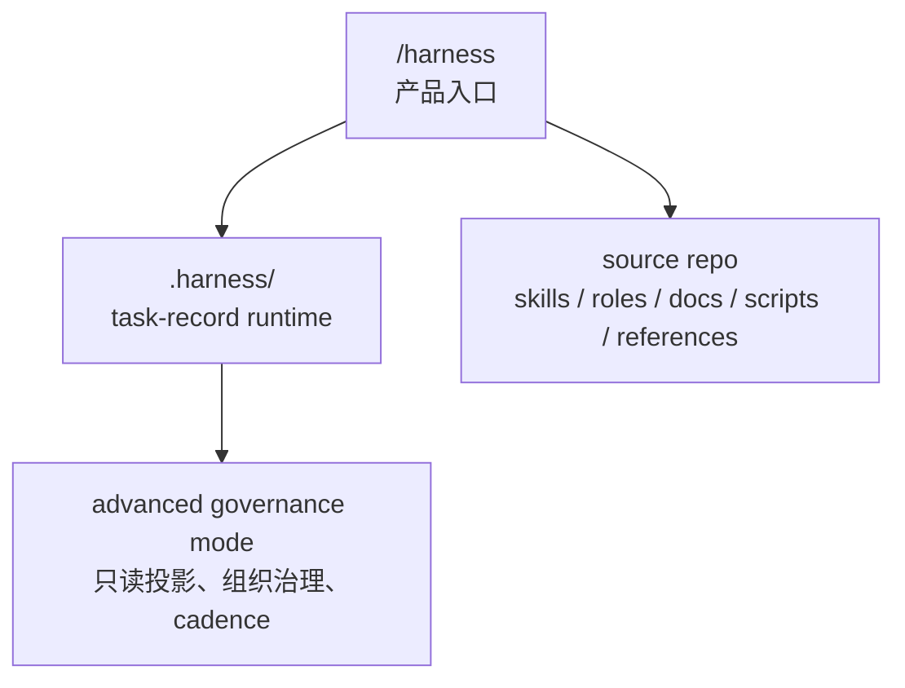

# Harness

`harness` 不是普通的技能仓库，它更像一套给 agent 用的公司操作系统。

这个 source repo 负责三件事：

1. 定义制度：`skills/`、`roles/`、`docs/workflows/`
2. 定义合同：`references/`
3. 提供执行器：`scripts/`

它不保存任何 consumer repo 的 live runtime truth。真正运行时的任务状态，只会按需 materialize 到 consumer repo 的 `.harness/`。

## 一句话心智模型

`harness = /harness 入口 + 按需 materialize 的 task-record runtime + 可选 governance projection + shell-native 状态机与审计系统`

## 四层分层



对应参考：

- [references/layering.md](/Users/vx/WebstormProjects/harness/references/layering.md)
- [references/runtime-workspace.md](/Users/vx/WebstormProjects/harness/references/runtime-workspace.md)
- [references/top-level-surface.md](/Users/vx/WebstormProjects/harness/references/top-level-surface.md)
- [task-record-runtime-tree-v2.toml](/Users/vx/WebstormProjects/harness/references/contracts/task-record-runtime-tree-v2.toml)

## 最小 runtime

v2 的最小 runtime 已经收敛到 flat task-record：

```text
.harness/
  manifest.toml
  entrypoint.md
  README.md
  tasks/
    WI-xxxx/
      task.md
      attachments/
      closure/
      history/
        transitions/
  locks/
```

核心约束：

1. `task.md` 是唯一任务真相
2. Recovery 写在同一个 `task.md` 里
3. `archived` 用状态字段表达
4. board 不是默认 runtime contract；默认改为 shell query

## `task.md` 是什么

`.harness/tasks/WI-xxxx/task.md` 是唯一任务真相。

它不只是轻 ticket，而是一个重实体 task record，至少承载这几组字段：

1. 身份与主状态
   - `ID`
   - `Title`
   - `Type`
   - `Status`
   - `Priority`
2. claim / 执行上下文
   - `Assignee`
   - `Worktree`
   - `Claimed at`
   - `Claim expires at`
   - `Lease version`
3. 流程路由
   - `Current stage owner`
   - `Current stage role`
   - `Next gate`
   - `Required departments`
   - `Participation records`
4. gate / 签字状态
   - `Decision status`
   - `Review status`
   - `QA status`
   - `UAT status`
   - `Acceptance status`
5. 恢复协议
   - `## Recovery`
   - `Current focus`
   - `Next command`
   - `Recovery notes`
6. 关联材料
   - `Linked attachments`
   - `attachments/`
   - `history/transitions/`

## 主状态机

v2 的主状态只保留：

```text
backlog -> planning -> ready -> in-progress -> review -> done -> archived
```

补充分支：

- 任意执行中可进 `paused`
- 任意阶段可进 `killed`
- `archived` 表示退出默认 active query surface，而不是物理搬目录

`review / QA / UAT / acceptance` 默认不再膨胀成主状态，而是 gate 字段。

## Attachments

task-local 正式材料默认放在 `attachments/`：

1. `Research Dispatch`
   - `.harness/tasks/<task-id>/attachments/<date>-<slug>-research-dispatch.md`
2. `Research Memo`
   - `.harness/tasks/<task-id>/attachments/<date>-<slug>-research-memo.md`
3. `Decision Pack`
   - `.harness/tasks/<task-id>/attachments/<date>-<slug>-decision-pack.md`
4. `Checkpoint`
   - `.harness/tasks/<task-id>/attachments/<date>-<slug>-checkpoint.md`
5. `Source Note`
   - `.harness/tasks/<task-id>/attachments/sources/<date>-<slug>.md`

只有显式 `--promote-governance` 且 runtime 已进入 advanced governance mode，才允许写到 `.harness/workspace/*`。

## 命令面

推荐高层入口：

```bash
./scripts/work_item_ctl.sh status --json --all
./scripts/work_item_ctl.sh start --json company
./scripts/work_item_ctl.sh pause --expected-from-status in-progress --expected-version <v> --interrupt-marker risk-review-required <WI-xxxx>
./scripts/work_item_ctl.sh resume --expected-version <v> <WI-xxxx>
./scripts/work_item_ctl.sh close --json --target-status review --work-item <WI-xxxx> company
./scripts/query_work_items.sh --status in-progress --assignee codex
```

注意：

1. `status` 现在是 `query` 别名，不再是“open 当前焦点”
2. task-local artifact 写回一律要求显式 `--work-item`
3. `./scripts/upsert_work_item_recovery.sh` 写入 `task.md` 的 `## Recovery`

## 运行时读取顺序

materialized runtime 下，正确读取顺序是：

1. `.harness/README.md`
2. `.harness/entrypoint.md`
3. `./scripts/query_work_items.sh` 的结果，或明确的 `.harness/tasks/<task-id>/task.md`
4. 若状态为 `in-progress` / `paused`，再读该 task 的 `## Recovery`
5. 只在需要时读取 `attachments/` 和 `history/transitions/`

## 验证与审计

framework source repo：

```bash
./scripts/validate_source_repo.sh
./scripts/audit_role_schema.sh
./scripts/run_governance_surface_diagnostic.sh --mode source
```

materialized runtime：

```bash
./scripts/validate_workspace.sh --mode core
./scripts/audit_state_system.sh --mode core
./scripts/audit_document_system.sh
./scripts/validate_freshness_gate.sh --staged
./scripts/run_state_validation_slice.sh
```

## 设计纪律

1. `task.md` 是唯一任务真相
2. query 是视图，不是账本
3. 目录不承载业务状态
4. Recovery 只回答恢复执行所需的最小问题
5. task-local first，governance by explicit promotion
6. source repo 不保存 consumer runtime 的 live state
