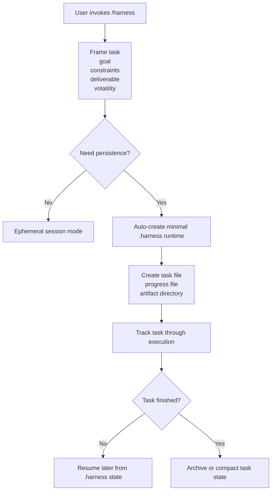

# Harness Invoke-First vNext Spec v1

- Status: proposal
- Date: 2026-03-25
- Intention: redefine `harness` from install-first framework to invoke-first task operating system

## Divergent Hypotheses

1. Keep `install-first`
   - user installs harness into repo first
   - root overlays and consumer carrier are established up front
   - task tracking begins only after framework attachment
2. Go `session-only`
   - `/harness` behaves like a pure one-shot skill
   - no repo-local persistence
   - no task continuity beyond the current conversation
3. Go `invoke-first + lazy materialization`
   - user enters via `/harness`
   - default mode is zero ceremony and zero repo hijack
   - `.harness/` appears automatically only when the task needs continuity, traceability, or resumability

## First Principles Deconstruction

The user does not want:

1. an installation ritual before receiving value
2. root `AGENTS.md / CLAUDE.md / GEMINI.md` takeover
3. provider-specific adapter complexity as the product entrypoint
4. repo mutation before the need for persistence is proven

The user does want:

1. immediate entry like `/brainstorming`
2. explicit task framing and progress ownership
3. continuity when a task spans multiple turns or sessions
4. low-intrusion repo-local truth when continuity is actually needed
5. a system that feels like a task protocol, not a repo coup

Therefore:

1. `install` cannot remain the primary product verb
2. `overlay` cannot remain the default repo integration mode
3. `session-only` is insufficient for long-running or reviewable work
4. the strongest design is `invoke-first + lazy materialization`

## Convergence To Excellence

`harness vNext` is:

> a zero-ceremony task operating protocol entered via `/harness`, with automatic repo-local persistence only when the task justifies it

This means:

1. `/harness` is the primary entrypoint
2. `.harness/` is runtime state, not a prerequisite
3. root provider files are not modified by default
4. persistence is task-scoped, not repo-scoped takeover
5. provider adapters become optional packaging concerns, not the main product story

## Product Definition

### Primary User Story

The user writes:

`/harness help me drive this requirement from framing to completion`

The system then:

1. scopes the task
2. determines whether persistence is needed
3. if not needed, runs in session mode only
4. if needed, creates minimal `.harness/` state automatically
5. continues tracking the task until completion or archival

### Canonical Product Sentence

`harness` is not something the user installs before work.
`harness` is something the user invokes when they want disciplined execution on a task.

## Runtime Modes

### Mode A: Ephemeral Session Mode

Use when:

1. the task is expected to finish in one session
2. no cross-session recovery is needed
3. no formal task history needs to survive the chat

Properties:

1. no `.harness/` write is required
2. no root files are touched
3. the conversation remains the temporary execution carrier

### Mode B: Stateful Task Mode

Enter automatically when any of the following becomes true:

1. the task will not close in the current session
2. the task needs resumability
3. the task needs explicit artifact linkage
4. the task needs review, audit, or decision trace
5. the task will involve multiple agent passes or handoffs

Properties:

1. `.harness/` is materialized automatically
2. only minimal task runtime is created
3. persistence remains scoped to the active task and its artifacts

## Lazy Materialization Rules

When stateful task mode is triggered, `harness` may create:

1. `.harness/manifest.toml`
   - identifies repo-local harness runtime version and behavior flags
2. `.harness/tasks/<task-id>.md`
   - task identity, status, goal, constraints, current owner, links
3. `.harness/progress/<task-id>.md`
   - current focus, next command, recovery notes
4. `.harness/artifacts/<task-id>/`
   - task-scoped memos, decision packs, review notes, outputs
5. `.harness/archive/`
   - closed task records and compacted history

The runtime must not materialize broad governance surface by default.

Do not create automatically on first persistence:

1. department trees
2. company-wide boards
3. provider overlays
4. role projection directories
5. large archive taxonomies

## Interaction Flow

## Canonical Boundaries

### What `harness` Owns

1. task framing protocol
2. persistence decision
3. task-scoped runtime artifacts
4. recovery protocol
5. reviewable execution trail

### What `harness` Does Not Own By Default

1. root repo entrypoint files
2. provider-specific global configuration
3. preinstalled consumer carrier structure
4. whole-repo workflow takeover
5. background automation assumptions

## Deletions And Demotions From Current Direction

The following should be removed from the primary product story:

1. `install-first`
2. consumer `carrier` as the default user-facing concept
3. root `AGENTS.md / CLAUDE.md / GEMINI.md` overlay as the normal entry
4. projection symmetry as a first-order goal
5. consumer-repo bootstrap ritual before first value

The following should be demoted to internal or optional concerns:

1. `.agents/skills/harness/`
2. `.claude/`
3. `.codex/`
4. `.gemini/`
5. projection sync scripts

## Script Surface vNext

Primary user-facing control surface should collapse to a task-first shape:

1. `/harness`
2. `harness resume`
3. `harness status`
4. `harness close`

Framework maintenance scripts may still exist in the source repo, but they are no longer the product entrypoint.

Install-related scripts and commands should not define the core user experience.

## Migration Direction

### Phase 1: Product Reframe

1. treat this spec as the new design center
2. stop describing `install` as the default product action
3. stop describing overlay as the expected first-hop in user repos

### Phase 2: Runtime Reduction

1. redefine `.harness/` around task-scoped minimum viable state
2. postpone company-level governance trees unless the user explicitly upgrades
3. preserve only the artifacts required for resumability and reviewability

### Phase 3: Internal Packaging Cleanup

1. keep source-repo scripts only if they support internal maintenance
2. delete or demote user-facing install rhetoric
3. treat provider projections as optional distribution plumbing

## Non-Goals

1. do not remove the possibility of persistence
2. do not regress to pure prompt-only orchestration
3. do not secretly mutate the repo without telling the user that tracking has started
4. do not preserve old framework complexity just because it already exists

## Product Discipline

1. zero ceremony
2. explicit but minimal writeback
3. no repo hijack
4. no provider lock-in in the core semantics
5. no install narrative unless the user explicitly asks for system-wide attachment

## Sharp Conclusion

The best `harness` is not:

1. a repo takeover framework
2. a pure chat prompt

The best `harness` is:

1. invoked like a skill
2. stateful like a task system when needed
3. nearly invisible until persistence earns its right to exist
