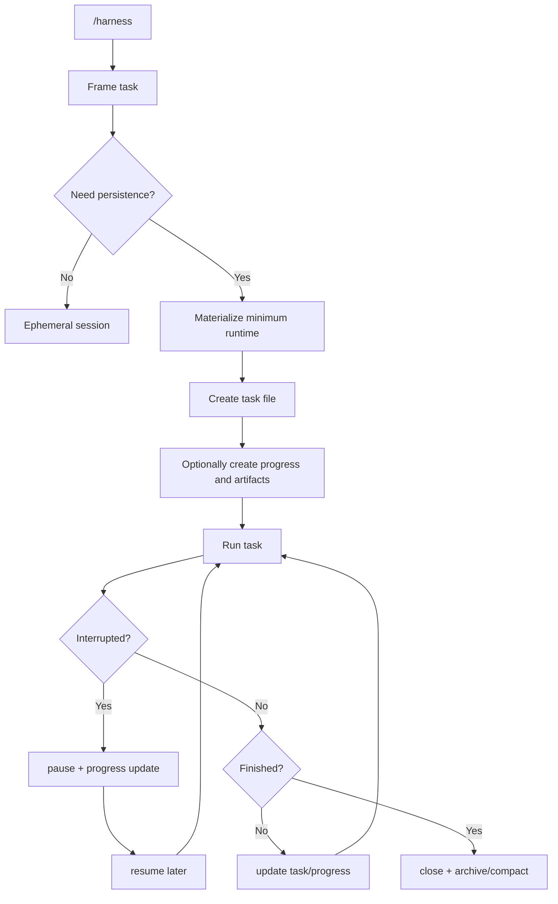

# Harness Minimum Core Runtime Contract v1

- Status: proposal
- Date: 2026-03-26
- Scope: define the minimum default runtime for invoke-first `harness`
- Design center: [2026-03-25-harness-invoke-first-vnext-spec-v1.md](../archive/harness/2026-03-25-harness-invoke-first-vnext-spec-v1.md)

## Divergent Hypotheses

1. Keep the old broad runtime
   - large workspace tree
   - governance-first structure
   - many directories created up front
2. Go session-only
   - `/harness` never writes repo-local state
   - no resumability outside chat
3. Define a minimum core runtime
   - `/harness` stays zero-ceremony by default
   - `.harness/` appears only when persistence is justified
   - only the smallest task runtime is materialized

## First Principles

The default `/harness` experience must answer only these questions:

1. what task are we doing
2. what state is it in
3. how do we resume it
4. what artifacts belong to it
5. how do we close it cleanly

The default runtime must not require:

1. organization charts
2. department trees
3. recurring cadences
4. provider-owned repo files
5. install rituals
6. background governance machinery

Therefore the default runtime should be:

1. task-scoped
2. resumable
3. reviewable
4. low-intrusion
5. deletable and compactable

## Convergence

The minimum core runtime is:

> the smallest repo-local state needed for a single task to survive beyond one chat while remaining understandable, resumable, and auditable

## Runtime Modes

### Mode A: Ephemeral Task Session

Use when:

1. the task is expected to finish in one conversation
2. no explicit resume is needed
3. no reviewable artifact must survive the chat

Contract:

1. no `.harness/` write is required
2. the conversation is the temporary execution context
3. the agent may still produce an output artifact if the user explicitly asks for one

### Mode B: Minimum Core Runtime

Enter automatically when any of the following becomes true:

1. the task will not naturally close in the current session
2. the task needs a typed state transition
3. the task needs `pause` / `resume`
4. the task needs explicit artifact linkage
5. the task needs decision, review, or research writeback
6. the user asks to keep tracking the task

Contract:

1. `.harness/` may be created automatically
2. only the minimum file tree may be created
3. no advanced governance tree may be created by default

## Primary Control Surface

The default user-facing control surface should collapse to:

1. `/harness`
   - frame a task
   - decide whether to stay ephemeral or materialize runtime
2. `harness status`
   - show the current tracked task and its state
3. `harness resume`
   - reopen the current tracked task from repo-local state
4. `harness close`
   - close the current tracked task and archive or compact its state

Current source-repo scripts may still implement the internals, but they are not the primary product verbs.

## Minimum File Tree

When runtime is materialized, only these paths should be considered canonical minimum surface:

```text
.harness/
  manifest.toml
  current-task
  tasks/
    WI-0001/
      task.md
      progress.md
      refs/
      working/
      outputs/
      closure/
      history/
        transitions/
  archive/
    tasks/
```

## Path Semantics

### `.harness/manifest.toml`

Purpose:

1. identify runtime schema version
2. record creation mode
3. record whether advanced governance has been enabled

Must not become:

1. a giant config registry
2. provider-specific settings dump

Minimum fields:

1. `schema_version`
2. `runtime_mode`
3. `advanced_governance_enabled`
4. `created_at`
5. `updated_at`

### `.harness/current-task`

Purpose:

1. point to the current active task id
2. allow fast reopen without scanning the whole tree

Must not become:

1. a summary file
2. a second source of truth

### `.harness/tasks/<task-id>/task.md`

Purpose:

1. be the task source of truth
2. carry task identity, intent, status, and links

Minimum fields:

1. `Task ID`
2. `Status`
3. `Goal`
4. `Constraints`
5. `Deliverable`
6. `Owner`
7. `Volatility`
8. `Created at`
9. `Updated at`
10. `Artifacts`

Task states should stay minimal:

1. `framing`
2. `ready`
3. `in-progress`
4. `paused`
5. `review`
6. `done`
7. `killed`

### `.harness/tasks/<task-id>/progress.md`

Purpose:

1. carry recovery state
2. tell the next agent exactly how to continue

It must answer only:

1. what is the current focus
2. what is the next command
3. what recovery notes matter
4. what task snapshot this progress belongs to

Minimum fields:

1. `Task ID`
2. `Current focus`
3. `Next command`
4. `Recovery notes`
5. `Status snapshot`
6. `Updated at`

### `.harness/tasks/<task-id>/refs/`, `working/`, `outputs/`, `closure/`

Purpose:

1. hold task-scoped artifacts and working state
2. prevent decisions, research, and reviews from floating in chat only

Allowed contents:

1. `refs/`
   - linked evidence, source notes, decision and review artifacts
2. `working/`
   - scratch, agent passes, in-flight discussion notes
3. `outputs/`
   - deliverables the task produced
4. `closure/`
   - closeout and promotion records

Must not become:

1. a company-wide knowledge base
2. a shared dump for unrelated tasks

### `.harness/archive/`

Purpose:

1. hold closed task records
2. support compaction without losing traceability

Archive action should happen when:

1. a task reaches `done`
2. a task reaches `killed`
3. a task has been closed and compacted out of active runtime

## Runtime Write Rules

### When `.harness/` may be auto-created

1. the user asks to keep tracking the task
2. the agent predicts multi-session work
3. the task enters `in-progress` and cannot finish naturally in-session
4. the task needs formal pause/resume semantics
5. the task emits a decision, review, or research artifact worth preserving

### What may be auto-created on first materialization

1. `.harness/manifest.toml`
2. `.harness/current-task`
3. `.harness/tasks/<task-id>/task.md`
4. `.harness/tasks/<task-id>/progress.md` only if needed
5. task-local `refs/`, `working/`, `outputs/`, or `closure/` only if needed
6. task-local `history/transitions/` as the canonical transition ledger
7. `.harness/archive/`

### What must not be auto-created in the minimum runtime

1. department directories
2. org charts
3. board systems
4. cadence reports
5. provider entrypoint mirrors
6. company-wide decisions ledger
7. large `workspace/` trees

## Execution Loop



## Mapping To Current Internals

The current script layer already implies a useful internal kernel.

The product-level mapping should be:

1. `/harness`
   - internally may call task framing plus `new_work_item.sh`
2. `harness status`
   - internally may call `work_item_ctl.sh open` or equivalent
3. `harness resume`
   - internally may call `resume_work_item.sh` or equivalent
4. `harness close`
   - internally may call `complete_work_item.sh` or equivalent

But these implementation details should stay behind the product verbs.

## Non-Goals

1. do not recreate the old `.harness/workspace/` breadth by default
2. do not force every task into persistence
3. do not make progress files into mini-diaries
4. do not make artifact directories shared cross-task dumps
5. do not upgrade into advanced governance implicitly

## Sharp Conclusion

The minimum core runtime should feel like:

1. a task envelope
2. a recovery envelope
3. an artifact envelope

It should not feel like:

1. a company operating system
2. a provider integration framework
3. a repo takeover ceremony
