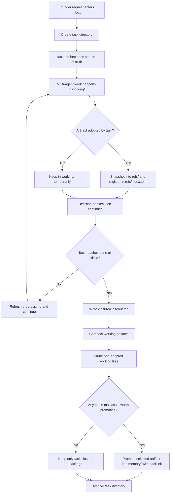

# Harness Task-Closure Asset Model v1

- Status: proposal
- Date: 2026-03-26
- Scope: define a founder-to-task runtime model where multi-agent intermediate artifacts converge into a self-contained task closure
- Related:
  - [2026-03-26-harness-minimum-core-runtime-contract-v1.md](./2026-03-26-harness-minimum-core-runtime-contract-v1.md)
  - [2026-03-26-harness-surface-buckets-v1.md](../archive/harness/2026-03-26-harness-surface-buckets-v1.md)
  - [2026-03-25-harness-invoke-first-vnext-spec-v1.md](../archive/harness/2026-03-25-harness-invoke-first-vnext-spec-v1.md)

## Problem

Founder 抛出一个需求后，真实执行过程通常会经历：

1. 多轮 framing
2. 多 agent research / dissent / refinement
3. 多份中间 brief、discussion、scratch notes
4. 最后才收敛成一个真正应该长期保留的 task package

如果 `.harness` 只是把这些中间物料不断堆积成全局目录，会出现三个问题：

1. active truth 不清楚
2. 文件很多，但 task 本身不闭包
3. 过时中间态长期污染工作台与知识库

本 spec 要解决的是：

> 让 task 成为真正的资产闭包单元；让重要 ref 跟 task 一起保留；让 raw intermediate artifacts 在 compaction 后可以被清理

## Divergent Hypotheses

### Hypothesis 1: Global Knowledge Base First

把 Founder brief、research、discussion、decision 全部写进共享 `.harness/workspace/*` 树。

优点：

1. 早期实现简单
2. 方便全局搜索

缺点：

1. task 不闭包
2. 中间态和稳定资产混在一起
3. 很难安全清理
4. 像资料仓，不像执行系统

### Hypothesis 2: Board / Ticket First

把 `.harness` 做成 board + work item，artifact 只保留少量链接。

优点：

1. 进度追踪清晰
2. 管理视图直观

缺点：

1. task 证据容易漂在外面
2. 链接会腐烂
3. 中间态如何压缩和保留没有明确规则

### Hypothesis 3: Task-Closure Asset Model

把 `task directory` 作为唯一执行闭包单元：

1. task metadata 在 task 内
2. progress 在 task 内
3. 被 task 正式采用的 refs 快照进 task 内
4. raw discussions / scratch 先在 task 的 working 区产生
5. close 时 compaction，保留 refs，清理未采用中间态
6. board 只是从 task 派生

## First Principles Deconstruction

不要从 Jira、Notion 或传统知识库类比出发，直接回到基本事实。

系统必须回答的真实问题只有这些：

1. 这个 Founder 需求现在对应哪个 task
2. 这个 task 当前处于什么状态
3. 如果现在中断，下一位 agent 如何恢复
4. 哪些材料是真正支撑 task 的证据包
5. 哪些材料只是过程噪音，应该在收口后被压缩或删除
6. 任务完成后，如何留下一个可回放、可审计、可复用的闭包

由此推出：

1. `task` 必须是 source of truth，不是 board
2. `board` 必须是派生视图，不是编辑面
3. `ref` 必须是 task 本地闭包内的 retained snapshot，而不是漂在全局树上的脆弱路径
4. `working` 文件必须允许丢弃，否则系统会被中间态淹没
5. 只有被 task 正式采用的 artifact，才值得长期保留
6. 跨 task 可复用资产必须走显式 `promote`，不能靠默认全局堆积

## Convergence To Excellence

最佳方案是 `Task-Closure Asset Model`：

> 每个 task 是一个目录闭包；所有正式采用的 refs 都被收进 task；所有未采用的中间态在 compaction 后可被清理；全局 board 与知识层只消费 task 导出的稳定结果

这比“全局知识库优先”更抗熵增，也比“纯 ticket 系统”更保留证据。

## Target Runtime Shape

这是推荐的目标目录，而不是当前脚本实现的历史路径兼容层。

```text
.harness/
  manifest.toml
  current-task
  inbox/
    F-20260326-001-founder-request.md
  boards/
    company.md
    founder.md
  tasks/
    T-0001-market-alerts/
      task.md
      progress.md
      refs/
        index.toml
        founder-brief.md
        research-memo.md
        decision-pack.md
        acceptance-review.md
      working/
        discussions/
        agent-passes/
        scratch/
      outputs/
      closure/
        closeout.md
        promotion-log.md
  memory/
    decisions/
    research/
    patterns/
  archive/
    tasks/
      T-0001-market-alerts/
```

## Directory Semantics

### `.harness/inbox/`

作用：

1. 接 Founder 原始需求
2. 记录 task 还没正式成形前的 intake 物料

规则：

1. inbox item 不是 task
2. 一个需求一旦被正式接单，应建立 task 并回链
3. 被 task 吸收后，inbox item 保留原始输入，但不继续承担执行真相

### `.harness/tasks/<task-id>/task.md`

作用：

1. task 的唯一 source of truth
2. 记录状态、目标、约束、owner、当前决策需求、闭包清单

最低字段建议：

1. `Task ID`
2. `Title`
3. `Status`
4. `Goal`
5. `Constraints`
6. `Deliverable`
7. `Owner`
8. `Decision needed`
9. `Why it matters`
10. `Created at`
11. `Updated at`
12. `Pinned refs`
13. `Outputs`
14. `Promoted memory`

### `.harness/tasks/<task-id>/progress.md`

作用：

1. 恢复协议
2. 只回答“现在在做什么”和“下一步怎么继续”

规则：

1. progress 不是决策本体
2. progress 不写长篇讨论
3. task close 后，progress 不再继续活跃更新

### `.harness/tasks/<task-id>/refs/`

作用：

1. 保存 task 正式采用的关键材料快照
2. 保证 task 可闭包回放

规则：

1. 只有被 `task.md` 或 `closure/closeout.md` 明确引用的 artifact 才能进入 `refs/`
2. `refs/` 中应尽量保存稳定 snapshot，而不是继续指向脆弱外链路径
3. `refs/index.toml` 负责登记：
   - `ref_id`
   - `kind`
   - `status`
   - `origin_path`
   - `adopted_reason`
   - `adopted_at`

### `.harness/tasks/<task-id>/working/`

作用：

1. 容纳多 agent 多轮协作产生的中间态
2. 提供一个允许混乱但可回收的缓冲层

子类建议：

1. `discussions/`
   - 多轮分析、争论、方案草图
2. `agent-passes/`
   - 某 agent 的完整工作轮记录
3. `scratch/`
   - 临时 memo、拆解、草稿

硬规则：

1. `working/` 默认不进入长期知识层
2. `working/` 文件只有两种结局：
   - 被采纳并 snapshot 到 `refs/`
   - 被 compaction 后删除

### `.harness/tasks/<task-id>/outputs/`

作用：

1. 保存 task 交付物
2. 包括 spec、patch、report、页面、数据导出等

### `.harness/tasks/<task-id>/closure/`

作用：

1. 保存 task 的收口结果
2. 记录为什么保留这些 refs、为什么删除那些 working 文件

最少文件建议：

1. `closeout.md`
   - 任务结论
   - 采用了哪些 refs
   - 哪些 working 文件已 compact / pruned
   - 后续 follow-up
2. `promotion-log.md`
   - 哪些内容被提升为跨 task 资产

### `.harness/memory/`

作用：

1. 保存从 task 中显式提升出来的跨 task 资产
2. 它不是默认垃圾桶

进入条件：

1. 对多个 task 有复用价值
2. 已经稳定
3. 带来源回链
4. 明确知道为什么不应只留在单个 task 闭包里

### `.harness/boards/`

作用：

1. 只提供管理视图
2. 支持 Founder / company / department 观察当前进度

硬规则：

1. generated-only
2. 不手工编辑
3. 只读取 `task.md`、`progress.md` 和必要 closure metadata

## Task State Machine

建议采用这组状态：

1. `intake`
2. `framing`
3. `research`
4. `decision`
5. `ready`
6. `in-progress`
7. `review`
8. `paused`
9. `done`
10. `killed`
11. `archived`

解释：

1. `intake`
   - Founder 需求刚进入系统，尚未成 task 或 task 尚未封装完 framing
2. `framing`
   - 正在收敛问题定义与约束
3. `research`
   - 正在采证、找反证、补上下文
4. `decision`
   - 正在等待或形成明确决策包
5. `ready`
   - 任务边界已稳定，可以进入执行
6. `in-progress`
   - 正在做交付
7. `review`
   - 正在验收或等待 Founder / reviewer 结论
8. `paused`
   - 受 blocker、风险或资源切换中断
9. `done`
   - 任务完成，等待归档或已完成 closeout
10. `killed`
   - 任务终止，但历史仍需保留
11. `archived`
   - 已离开 active surface，只保留可追溯记录

## Artifact Classes

把文件按角色分成五类：

1. `intake`
   - 原始 Founder 输入
2. `working`
   - 协作中的中间态
3. `ref`
   - 被 task 正式采用的关键材料
4. `output`
   - task 产生的交付物
5. `memory`
   - 被提升为跨 task 资产的稳定材料

## Artifact Status Lifecycle

每个 artifact 建议有如下状态：

1. `working`
2. `candidate-ref`
3. `pinned-ref`
4. `compacted`
5. `promoted`
6. `archived`
7. `pruned`

语义：

1. `working`
   - 仍属中间态
2. `candidate-ref`
   - 可能会被 task 采用
3. `pinned-ref`
   - 已进入 task `refs/`
4. `compacted`
   - 内容已被 closeout 或其他 retained ref 吸收
5. `promoted`
   - 已提升进 `.harness/memory/`
6. `archived`
   - 跟随 task 归档
7. `pruned`
   - 已安全删除

## Founder Requirement To Task Closure Flow



## File Routing Rules

### Rule 1: Founder 原始输入先落 `inbox`

不要直接把 Founder 原话塞进某个长期 brief 总表。

### Rule 2: 一旦正式接单，立刻建立 `task directory`

task 必须尽快成为唯一执行真相。

### Rule 3: 所有中间讨论先进入 `working/`

不要一开始就把所有草稿包装成“正式资产”。

### Rule 4: 只有被采用的材料才能进入 `refs/`

进入 `refs/` 代表：

1. 这个文件支撑了 task 的判断或交付
2. 它值得跟 task 一起长期保留

### Rule 5: close 前必须先做 compaction

close 不是简单改状态，而是：

1. 写 closeout
2. 固化 pinned refs
3. 删除未采用 working
4. 选择性 promote

### Rule 6: board 永远从 task 派生

不能反过来让 board 承担主数据输入。

## Cleanup Rules

以下文件允许被删除：

1. 未被 `refs/` 采用的 `working/discussions/*`
2. 未被 `refs/` 采用的 `working/agent-passes/*`
3. 未被 `closeout.md` 点名保留的 `scratch/*`

以下文件不得在 close 时删除：

1. `task.md`
2. `progress.md`
   - 可以停止更新，但应保留最后快照
3. `refs/*`
4. `outputs/*`
5. `closure/*`

以下文件只有在 promote 后才进入全局层：

1. 稳定决策
2. 可复用研究结论
3. pattern / trap / playbook

## Why This Beats The Current Split Model

相对“全局 brief / decision / board 树 + 分散链接”，这个模型的优势是：

1. task 自带闭包，不怕路径腐烂
2. 中间态有明确垃圾回收规则
3. board 仍然可做，但不再是主数据平面
4. 知识沉淀从“默认堆积”改成“显式 promote”
5. Founder 最终看到的是 task package，而不是一堆漂浮文件

## Migration Direction

从当前模型迁到这个模型时，建议分三步：

1. 先改心智，不急着一次性迁全仓
   - 新 task 采用目录闭包
   - 老路径先兼容
2. 再改 source of truth
   - 从 `work item file + scattered artifacts` 迁到 `task directory + local refs`
3. 最后收缩全局树
   - 把 `briefs / research / decision` 的 active 主入口收敛到 task 内
   - 全局层只保留 board、memory、archive

## Sharp Rule

如果一个文件：

1. 不在 `task directory`
2. 不是全局 derived board
3. 不是显式 promoted memory
4. 也不是 archive

那它大概率只是中间态，默认不应该永久存活。
